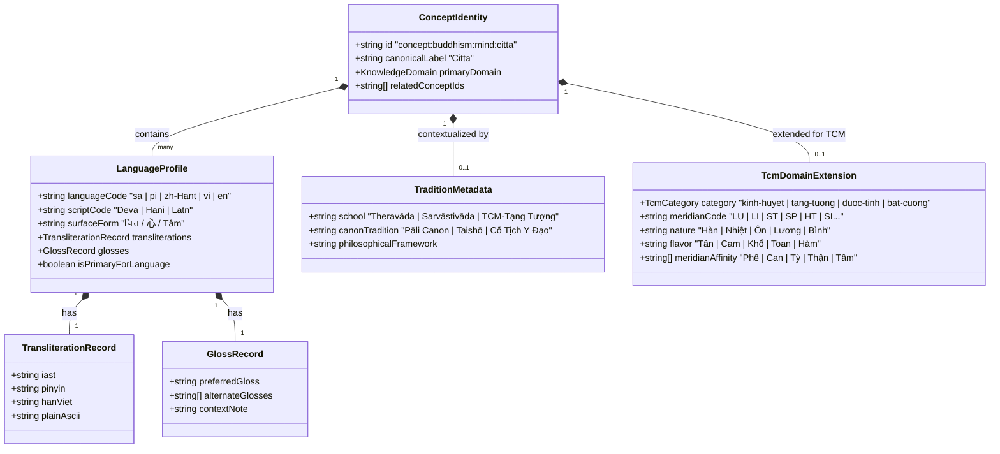

# ADR-058: Multilingual Term Identity & Language-aware Knowledge Foundation (P12.0)

**Status**: PROPOSED  
**Date**: 2026-08-30  
**Author**: Staff Software Engineer / Technical Architect  
**Deciders**: Engineering Lead, Technical Architect  
**Context**: Phase P12.0 — Multilingual Term Identity & Language-aware Knowledge Foundation  

---

## 1. Context (Bối cảnh)

Hệ thống Scholar Suite và Terminology Engine qua các giai đoạn từ P9.0 đến P11.0 đã xây dựng được một nền tảng vững chắc:
- **ADR-056**: Thiết lập `Universal Terminology Contract` (`src/types/terminology.ts`) với cấu trúc bất biến, `KnowledgeDomain` mở rộng qua Tagged Open Union, và phân định nguồn gốc xuất xứ (`TerminologySource`).
- **ADR-057**: Khóa baseline ánh xạ một chiều (`LexiconEntry` $\rightarrow$ `TerminologyEntry`) và định vị lộ trình tiến hóa.
- **P10.2 & P10.3**: Chuẩn hóa tra cứu Unicode NFD, loại bỏ dấu tiếng Việt và chuẩn hóa chuyển tự IAST (Pāli/Sanskrit $\rightarrow$ ASCII).
- **P11.0**: Hợp nhất từ điển thuật ngữ qua adapter `scholarUnifiedDictionary` tích hợp cả `LexiconEntry` (`lex-*`) và `SystemNode` (`sys-*`).

Tuy nhiên, khi mở rộng kho tri thức sang 4 trụ cột ngôn ngữ và học thuật chuyên sâu:
1. **Tiếng Hán / Cổ văn Trung Hoa** (Hán tự Phồn thể, Giản thể, Bính âm Pinyin có dấu/không dấu, Âm đọc Hán Việt).
2. **Tiếng Anh Học thuật** (Academic English glosses, philosophical translations, cross-tradition gloss variants).
3. **Tiếng Phạn / Sanskrit & Pāli** (Script gốc Devanagari/Brahmi, phiên âm học thuật IAST, ngữ căn Dhātu, hình thái học morphology).
4. **Đông Y / Y Học Cổ Truyền (TCM - Traditional Chinese Medicine)** (Kinh mạch, Huyệt vị, Tạng tượng, Dược tính, Quy kinh, Bát cương, Luận trị).

Mô hình dữ liệu hiện tại bộc lộ giới hạn kiến trúc rõ rệt.

---

## 2. Problem Statement (Vấn đề cốt lõi)

Mô hình hiện tại quản lý các biến thể ngôn ngữ dưới dạng từ điển phẳng `aliases: Record<string, string>` (ví dụ `{ vietnamese: "...", english: "...", pali: "...", sanskrit: "...", hanTu: "...", pinyin: "..." }`).

Cấu trúc này gặp các **điểm gãy nghiêm trọng** khi mở rộng:
1. **Mất phân biệt giữa Script và Transliteration**: Không thể biểu diễn cùng lúc chữ viết gốc (Devanagari, Phồn thể, Giản thể) và các hệ thống chuyển tự khác nhau (IAST, Harvard-Kyoto, Pinyin có thanh điệu, Wade-Giles, Hán Việt).
2. **Không phân biệt được Khái niệm cốt lõi (Concept Identity) và Hình thái từ vựng (Lexical Surface Forms)**: Một khái niệm học thuật (ví dụ *Tâm / Citta / Mind / 心*) có thể có nhiều cách dịch khác nhau tùy theo trường phái (*Theravāda*, *Sarvāstivāda*, *Yogācāra*, *Đạo Gia*, *Đông Y*), nhưng mô hình alias phẳng buộc phải chọn 1 chuỗi duy nhất hoặc nhồi nhét không cấu trúc.
3. **Nhập nhằng ngữ nghĩa theo trường phái / truyền thống (Semantic Ambiguity across Traditions)**: Thuật ngữ "Khí" trong Đông Y (*Qì - Năng lượng vận hành tạng phủ*) khác với "Khí" trong Huyền Không/Phong Thủy (*Sinh khí/Sát khí ngũ hành*), và tương đương một phần với *Vāyo/Prāṇa* trong Phạn ngữ. Alias phẳng không lưu trữ được metadata truyền thống (School/Tradition/System).
4. **Mất mát xuất xứ trích dẫn (Provenance Loss)**: Trích dẫn học thuật không chỉ dẫn nguồn chung chung, mà cần biết chính xác mục từ đang trích dẫn được dịch/chú giải theo ấn bản nào (*Taishō Tripiṭaka*, *Pali Text Society*, *Hoàng Đế Nội Kinh*, *Trung Dược Đại Từ Điển*).

---

## 3. Decision (Quyết định kiến trúc)

### 3.1. Thiết lập Mô hình Thực thể 3 Tầng (Three-Tier Terminology Entity Model)
Tách bạch tuyệt đối 3 tầng dữ liệu mà không trộn lẫn:
1. **Tier 1: Semantic Concept Identity (`ConceptId`)**: Đại diện cho thực thể ý niệm trừu tượng, liên kết các thuật ngữ tương đương ngữ nghĩa xuyên văn hóa và trường phái.
2. **Tier 2: Language & Script Profiles (`LanguageProfile`)**: Đại diện cho các biểu diễn ngôn ngữ cụ thể theo chuẩn BCP-47 / ISO-15924 (Surface form, Script gốc, Transliterations, Gloss variants).
3. **Tier 3: Tradition & Medical Domain Extension (`DomainContext`)**: Metadata định danh trường phái, hệ thống kinh điển, và thuộc tính chuyên biệt cho các ngành đặc thù như Đông Y (TCM).

### 3.2. Bảo Toàn Tính Bất Biến và Tương Thích Ngược (Backward Compatibility Envelope)
- **Tuyệt đối không xóa hay thay đổi đột ngột** interface `TerminologyEntry` hiện có.
- `TerminologyEntry` hiện tại được mở rộng thêm trường tùy chọn `conceptId?: string` và `languageProfiles?: Record<string, LanguageProfile>`.
- Trường `aliases: Record<string, string>` tiếp tục được duy trì như một **Flattened Compatibility Projection** được tự động sinh (derived/projected) từ `languageProfiles` để toàn bộ selectors, UI và search hiện tại tiếp tục hoạt động mà không vỡ.

### 3.3. Giữ Vững Ranh Giới Định Danh Riêng Biệt của Registry
- Không gộp cứng các nguồn vật lý (`lex-*` và `sys-*`) thành một bảng phẳng duy nhất.
- Mỗi registry (`lexiconRegistry`, `systemRegistry`, và sau này là `tcmRegistry`) giữ nguyên khóa chính (`id`) và schema đặc thù của mình. Adapter tầng trên (`unifiedDictionary`) chịu trách nhiệm ánh xạ và tổng hợp.

### 3.4. Định Chuẩn Hệ Ngôn Ngữ & Chuyển Tự Quốc Tế
- Mã ngôn ngữ chuẩn BCP-47: `vi` (Tiếng Việt), `zh-Hant` (Hán Phồn thể), `zh-Hans` (Hán Giản thể), `sa` (Sanskrit), `pi` (Pāli), `en` (Tiếng Anh).
- Mã hệ chữ viết ISO-15924: `Deva` (Devanagari), `Hani` (Hán tự), `Latn` (Latinh).
- Chuẩn chuyển tự học thuật: `iast` cho Phạn/Pāli, `pinyin` (có dấu thanh và số) cho tiếng Hán, `han-viet` cho âm đọc Hán Việt truyền thống.

---

## 4. Scope (Phạm vi)

- **Trong phạm vi P12.0 (Phase Thiết Kế)**:
  - Soạn thảo và hoàn thiện tài liệu kiến trúc (ADR-058).
  - Soạn thảo checklist chi tiết toàn bộ trường dữ liệu (`docs/specs/p12-0-multilingual-term-identity-field-checklist.md`).
  - Phác thảo thiết kế Type Contract và Pure Conversion Functions trên tài liệu.
  - Định hình Test Strategy và các kịch bản RED scenarios cho các phase triển khai sau.
- **Ngoài phạm vi P12.0 (Non-goals)**:
  - Chưa chỉnh sửa bất kỳ file production nào trong `src/`.
  - Chưa thay đổi runtime UI `MultilingualLexicon.tsx` hay `ScholarCitationModal.tsx`.
  - Chưa import/nhập liệu kho dữ liệu Đông Y hàng loạt.

---

## 5. Non-goals (Những việc không làm)

1. **Không thực hiện Over-Engineering / Vibe Coding**: Không tạo các ontology engine đa cấp quá phức tạp khi chưa có nhu cầu truy vấn đồ thị quan hệ tầng sâu.
2. **Không phá vỡ contract JSON/Local Storage**: Không thay đổi cấu trúc lưu trữ của người dùng hiện có.
3. **Không cưỡng ép hợp nhất ngữ nghĩa sai lệch**: Không ép buộc một thuật ngữ Đông Y phải gán ghép khiên cưỡng vào một thuật ngữ Phật học nếu chúng không có cùng nguồn gốc học thuật xác thực.

---

## 6. Proposed Domain Model (Mô hình miền đề xuất)



---

## 7. Data Contract Draft (Dự thảo giao kèo dữ liệu TypeScript)

```typescript
/**
 * Proposed in ADR-058 (Draft for Future P12 Implementation)
 */

export type StandardLanguageCode =
  | 'vi'        // Tiếng Việt
  | 'zh-Hant'   // Hán Phồn Thể
  | 'zh-Hans'   // Hán Giản Thể
  | 'sa'        // Sanskrit (Phạn)
  | 'pi'        // Pāli
  | 'en';       // English

export type StandardScriptCode =
  | 'Latn'      // Latin
  | 'Hani'      // Hanzi (Hán tự)
  | 'Deva';     // Devanagari

export interface TransliterationSet {
  readonly iast?: string;            // e.g. "citta", "śamatha"
  readonly pinyinWithTones?: string; // e.g. "xīn", "qì"
  readonly pinyinPlain?: string;     // e.g. "xin", "qi"
  readonly hanViet?: string;         // e.g. "Tâm", "Khí", "Thái Cực"
  readonly devanagari?: string;      // e.g. "चित्त"
  readonly plainAscii?: string;      // Normalized for instant search
}

export interface LanguageGlossSet {
  readonly preferred: string;        // Thuật ngữ dịch chính thức
  readonly alternates?: readonly string[]; // Các biến thể dịch học thuật khác
  readonly nuanceNote?: string;      // Chú thích sắc thái ngữ nghĩa
}

export interface LanguageProfile {
  readonly language: StandardLanguageCode;
  readonly script: StandardScriptCode;
  readonly surfaceForm: string;      // Từ nguyên bản (chữ Hán, chữ Phạn, chữ Việt)
  readonly transliterations?: TransliterationSet;
  readonly glosses?: LanguageGlossSet;
  readonly isCanonicalForLanguage?: boolean;
}

export interface TcmDomainExtension {
  readonly category: 'kinh-huyet' | 'tang-tuong' | 'duoc-tinh' | 'bat-cuong' | 'phuong-te';
  readonly meridianCode?: string;    // e.g. "LU-9" (Thái Uyên), "ST-36" (Túc Tam Lý)
  readonly property?: {
    readonly nature?: 'Hàn' | 'Nhiệt' | 'Ôn' | 'Lương' | 'Bình';
    readonly flavor?: readonly ('Tân' | 'Cam' | 'Khổ' | 'Toan' | 'Hàm')[];
    readonly channelTropism?: readonly string[]; // Quy kinh: Phế, Can, Tỳ, Vị, Thận...
  };
}

export interface MultilingualConcept {
  readonly conceptId: string;        // e.g. "concept:buddhism:citta"
  readonly canonicalLabel: string;   // e.g. "Citta"
  readonly primaryDomain: KnowledgeDomain;
  readonly profiles: Record<StandardLanguageCode, LanguageProfile>;
  readonly tradition?: {
    readonly school?: string;
    readonly canonRef?: string;
  };
  readonly tcmExtension?: TcmDomainExtension;
}
```

---

## 8. Search & Ranking Implications (Hệ quả đối với Tìm kiếm & Xếp hạng)

Hệ thống tìm kiếm hiện tại dựa trên hàm `calculateScholarRelevance` và `normalizeScholarText`. Khi có mô hình Language Profile, việc tìm kiếm sẽ đạt độ chuẩn xác vượt bậc theo cơ chế **Deterministic Weighted Matching**:

1. **Exact Surface Form Match (Trọng số 100)**: Match chính xác chữ Hán (Phồn/Giản), Devanagari, Tiếng Việt có dấu.
2. **Canonical / IAST Transliteration Match (Trọng số 90)**: Match chính xác Pāli/Sanskrit IAST (e.g. `citta`, `kamma`, `prajñā`).
3. **Pinyin & Hán Việt Match (Trọng số 80)**: Match theo Bính âm (`pinyin`) hoặc âm đọc Hán Việt (`hanViet`).
4. **Normalized ASCII / Unaccented Match (Trọng số 60)**: Match sau khi loại bỏ toàn bộ dấu qua `normalizeScholarText`.
5. **Preferred English Gloss Match (Trọng số 50)**: Match từ khóa dịch thuật tiếng Anh chính (`preferredGloss`).
6. **Alternate Gloss / Commentary Match (Trọng số 30)**: Match trong các biến thể dịch phụ hoặc chú giải.

---

## 9. Provenance & Citation Implications (Hệ quả đối với Trích dẫn & Xuất xứ)

Hệ thống trích dẫn Scholar Citation (`ScholarCitationViewModel`, `formatBibTeX`, `formatCSL`, `formatAPA`) sẽ hưởng lợi trực tiếp:
- Khi xuất citation cho một mục từ Hán học / Đông Y: Tự động trích dẫn đầy đủ cả Hán tự, Pinyin và Âm Hán Việt trong mục ghi chú xuất xứ.
- Khi xuất citation cho thuật ngữ Sanskrit: Tự động đính kèm Devanagari và IAST chuẩn quốc tế.
- Khóa chặt liên kết xuất xứ kinh điển: Chỉ rõ số mục Taishō ($T$), Pali Text Society ($PTS$), hoặc số chương trong Y điển (*Hoàng Đế Nội Kinh - Tố Vấn / Linh Khu*).

---

## 10. Blast Radius Assessment (Đánh giá vùng ảnh hưởng)

- **Tại Phase Thiết Kế (P12.0)**: **Blast radius = 0**.
  - Không thay đổi mã nguồn runtime.
  - Chỉ thêm tài liệu thiết kế (`docs/adr/`, `docs/specs/`).
- **Tại Phase Triển Khai Tiếp Theo**: **Blast radius được kiểm soát ở mức Thấp (Low & Contained)** nhờ:
  - Chiến lược bảo toàn lớp bọc `TerminologyEntry.aliases`.
  - Adapter chuyển đổi một chiều (One-way pure mapping).
  - Tách riêng registry Đông Y thành module độc lập, không xáo trộn registry Phật học/Huyền học hiện có.

---

## 11. Migration Strategy (Chiến lược di trú)

Quá trình di trú được chia thành 3 giai đoạn nhỏ (Sub-phases):
1. **P12.1 — Contract & Schema Types Enhancement**:
   - Khai báo các type mới trong `src/types/multilingual.ts` (hoặc mở rộng `terminology.ts`).
   - Viết pure schema validator và pure mapper `deriveAliasesFromProfiles()`.
2. **P12.2 — Pure Registry Enrichment**:
   - Bổ sung `languageProfiles` vào các mục từ trọng điểm trong `lexiconRegistry.ts` mà không làm thay đổi các trường hiện có.
   - Thêm bộ dữ liệu Đông Y mẫu (`tcmRegistry.ts`).
3. **P12.3 — Selector & Search Integration**:
   - Cập nhật `unifiedDictionary.search()` hỗ trợ tra cứu đa script/đa transliteration.
   - Cập nhật `MultilingualLexicon.tsx` bổ sung tab lọc Đông Y và chế độ hiển thị chi tiết chữ Hán/Sanskrit.

---

## 12. Test Strategy (Chiến lược kiểm thử)

Chiến lược kiểm thử tuân thủ nghiêm ngặt nguyên tắc Test-First:
1. **Contract Invariant Tests**: Kiểm tra tính hợp lệ của `LanguageProfile`, kiểm tra mã BCP-47 và ISO-15924.
2. **Deterministic Search Parity Tests**: Kiểm tra việc tìm kiếm bằng Hán tự, Pinyin, IAST, tiếng Anh, Hán Việt trả về đúng mục từ với thứ tự xếp hạng chính xác.
3. **Backward Compatibility Tests**: Đảm bảo 100% các unit tests cũ của `lexiconDictionary`, `unifiedDictionary`, `scholarCitation` tiếp tục PASS mà không cần sửa đổi.
4. **Attribution Invariant Tests**: Kiểm tra các mục từ Đông Y bắt buộc có nguồn xuất xứ y điển chuẩn xác.

---

## 13. Open Questions (Câu hỏi mở cần thảo luận)

1. **Chuẩn hóa chữ Hán**: Với các mục từ Đông Y và Dịch học, hệ thống nên ưu tiên hiển thị mặc định Hán Phồn thể (Traditional) hay Hán Giản thể (Simplified), hay cung cấp nút chuyển đổi song song trên UI?
2. **Phạm vi mã hóa Huyệt vị Đông Y**: Có cần tích hợp chuẩn mã hóa quốc tế của WHO cho danh pháp Huyệt vị (e.g. WHO Standard Acupuncture Point Locations) vào trường `meridianCode` không?
3. **Gốc ngữ pháp Sanskrit**: Có nên đưa toàn bộ bảng phân tích tiếp vĩ ngữ/tiếp đầu ngữ (Prefix/Suffix) vào một cấu trúc chuẩn riêng để phục vụ tra cứu chuyên sâu cho nhà nghiên cứu ngữ văn Phạn cổ?

---

## 14. Approval Gate (Cổng phê duyệt)

- Tài liệu này cần được Engineering Lead và Technical Architect đánh giá và phê duyệt trước khi bắt đầu bất kỳ công việc lập trình (implementation) nào ở các phase tiếp theo.
- Sau khi được phê duyệt, tài liệu sẽ chuyển trạng thái từ `PROPOSED` sang `ACCEPTED`.
