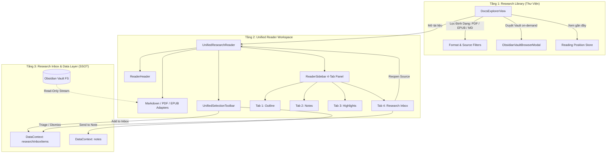

# ADR-076: Research Reading Workspace Architecture (Phase R1)

## Status
**Proposed** (Target: Phase R1 / Research Workbench)

## Context & Problem Statement
Hệ thống Knowledge OS hiện đã có các thành phần độc lập phục vụ việc đọc và trích xuất tri thức:
1. `DocsExplorerView.tsx`: Thư mục duyệt tài liệu cục bộ, ban đầu thiết kế cho tài liệu kỹ thuật nội bộ (ADR/Gherkin/Specs), sau đó được mở rộng thêm chế độ `epub-only`.
2. `UnifiedResearchReader.tsx`: Trình đọc đa định dạng (Markdown, PDF, EPUB) với thanh công cụ trích xuất (`UnifiedSelectionToolbar.tsx`) và trích dẫn học thuật.
3. `ObsidianVaultBrowserModal.tsx`: Modal duyệt cây thư mục Vault Obsidian ở chế độ chỉ đọc.
4. `ResearchInboxDrawer.tsx`: Hộp tiếp nhận trích đoạn tạm thời (`ResearchInboxItem`) để người dùng triage và lưu vào ghi chú.

Tuy nhiên, trải nghiệm người dùng hiện tại đang bị phân mảnh:
- **Ngôn ngữ kỹ thuật bị lộ**: Giao diện còn mang dấu vết "Docs Explorer / Specs / ADR" thay vì ngôn ngữ học thuật thân thiện "Thư Viện Sách / Thư Viện Nghiên Cứu".
- **Luồng thao tác đứt đoạn**: Người dùng phải chuyển qua lại giữa nhiều modal độc lập; trong khi đọc sách/tài liệu, thanh sidebar hiện tại chỉ có Mục lục (TOC) đơn thuần, chưa tích hợp ghi chú, đánh dấu (highlights) và hộp tiếp nhận (inbox) ngay trong không gian đọc.
- **Thiếu bộ lọc & phân loại tập trung**: Chưa có giao diện thư viện hợp nhất hỗ trợ lọc nhanh theo định dạng (PDF / EPUB / Markdown), lọc theo nguồn (Vault / Nội bộ) và chế độ xem linh hoạt (Card / List hybrid).

## Decision Drivers
1. **Trải nghiệm đọc nhất quán (Unified Reading Experience)**: Hợp nhất PDF, EPUB, Markdown vào một không gian làm việc duy nhất với thanh điều hướng và bộ công cụ tuyển chọn đồng bộ.
2. **Nguyên tắc Tiết lộ Lũy tiến (Progressive Disclosure)**: Học tập mô hình thiết kế từ NotebookLM workspace: Màn hình Thư viện tối giản khi khám phá $\rightarrow$ Workspace đọc đầy đủ khi mở tài liệu $\rightarrow$ Toolbar nổi ngữ cảnh khi bôi đen văn bản.
3. **Bảo toàn ranh giới Read-Only của Obsidian Vault**: Obsidian Vault là **Single Source of Truth (SSOT)** cho nội dung thô; ứng dụng chỉ đọc on-demand và **tuyệt đối không ghi ngược (no write-back)** vào tệp tin trên đĩa của Vault. Toàn bộ trích đoạn, ghi chú, highlights và vị trí đọc chỉ được lưu trong Database / LocalStorage của Dashboard.
4. **Bảo tồn hợp đồng dữ liệu hiện có**: Giữ nguyên cấu trúc `ResearchInboxItem` (`isProcessed: boolean`, `priority: number`), `ResearchExcerpt`, và các endpoint backend hiện tại.

## Alternatives Considered

### Phương án 1: Giữ nguyên DocsExplorerView và mở reader dưới dạng popup rời rạc
- **Ưu điểm**: Không cần tái cấu trúc component.
- **Nhược điểm**: Trải nghiệm bị gián đoạn, không có cảm giác một "Research Workbench" chuyên nghiệp, người dùng không thể quản lý ghi chú/trích đoạn ngay khi đang đọc.

### Phương án 2: Viết lại toàn bộ hệ thống lưu trữ và router riêng cho sách
- **Ưu điểm**: Tạo ra mô hình dữ liệu mới hoàn toàn độc lập.
- **Nhược điểm**: Blast radius quá lớn, yêu cầu thay đổi Prisma Schema, REST APIs và có nguy cơ làm hỏng hệ thống sync offline hiện có.

### Phương án 3 (Được chọn): Thiết kế Phase R1 "Research Reading Workspace" theo kiến trúc 3 phân tầng
- **Tầng 1 — Thư Viện Nghiên Cứu (Research Library)**: Nâng cấp `DocsExplorerView.tsx` thành thư viện tài liệu toàn diện (Lọc định dạng PDF/EPUB/MD, Lọc nguồn Vault/Nội bộ, Sắp xếp, Chuyển đổi Lưới/Danh sách, Mục đang đọc gần đây).
- **Tầng 2 — Không Gian Đọc Hợp Nhất (Unified Reader Workspace)**: Mở rộng `UnifiedResearchReader.tsx` với Topbar chuẩn hóa và Sidebar 4 tab tích hợp:
  - Tab 1: **Mục lục (Outline / TOC)**
  - Tab 2: **Ghi chú tài liệu (Notes)**
  - Tab 3: **Đoạn đánh dấu (Highlights)**
  - Tab 4: **Hộp trích đoạn (Research Inbox)**
- **Tầng 3 — Cơ Chế Điều Hướng Ngược (Source Locator Navigation)**: Mỗi trích đoạn lưu trữ `PositionSelector` chuẩn hóa (`headingId` cho Markdown, `pageNumber` cho PDF, `cfi` cho EPUB), cho phép bấm "Xem nguồn" từ Inbox để nhảy ngay về vị trí chính xác trong Reader.

## Architectural Boundaries & Concept Model

## Architectural Consequences & Trade-offs

### Tích Cực (Positive Consequences)
- **Chuẩn hóa trải nghiệm học thuật**: Toàn bộ luồng từ tìm sách $\rightarrow$ đọc tài liệu $\rightarrow$ bôi đen trích đoạn $\rightarrow$ phân loại trong Inbox $\rightarrow$ đúc kết thành Ghi chú được liền mạch trong một không gian duy nhất.
- **Giảm tải nhận thức**: Sidebar 4 tab có thể thu gọn giúp người đọc tập trung vào nội dung văn bản khi cần, hoặc mở rộng để tra cứu nhanh ngữ cảnh.
- **Không rủi ro cho dữ liệu gốc**: Tính bất biến của Obsidian Vault được đảm bảo 100%.

### Rủi Ro & Biện Pháp Kiểm Soát (Risks & Mitigations)
- **Rủi ro**: Render Sidebar 4 tab đồng thời với iframe PDF / canvas có thể gây tải lại không cần thiết.
  - *Biện pháp*: Áp dụng lazy tab rendering trong `ReaderSidebar` (chỉ mount nội dung tab đang kích hoạt) và ghi nhớ trạng thái tab bằng component state cục bộ.
- **Rủi ro**: Lệch vị trí định vị (locator drift) khi nhảy về trang PDF hoặc heading Markdown.
  - *Biện pháp*: Tái sử dụng `globalReadingPositionStore` đã được chuẩn hóa và kiểm thử trong các pha trước.

## Blast Radius & Rollback Plan
- **Blast Radius**: Giới hạn hoàn toàn trong các UI components (`src/components/docs/`, `src/components/reader/`, `src/components/research/`). Không thay đổi Database schema, không sửa đổi endpoint server, không làm ảnh hưởng các luồng Flashcard, Topic Tree hay AI Studio.
- **Rollback Plan**: Toàn bộ thay đổi là component UI thuần túy trên React, có thể rollback từng component mà không ảnh hưởng dữ liệu người dùng.
