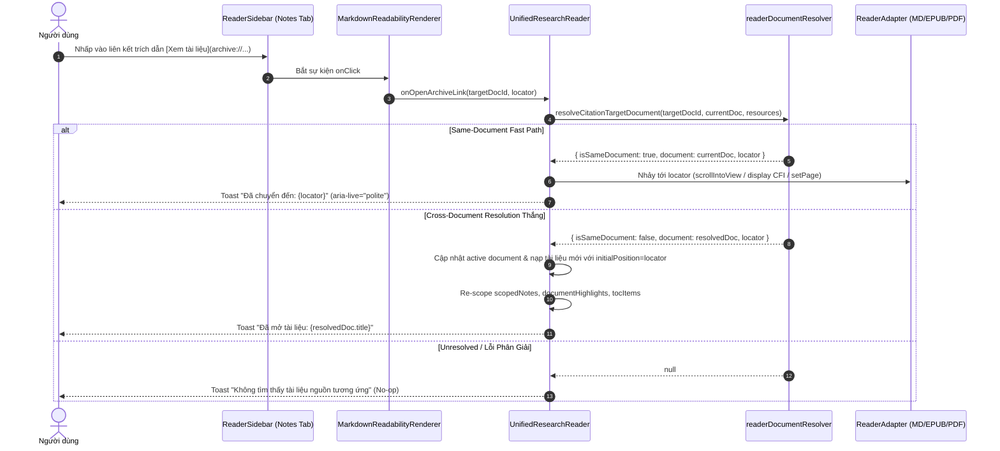

# ADR-077: Bidirectional Citation Deep-Link Navigation Architecture (Phase 19)

## Status
**Proposed** (Target: Phase 19 / Research Workbench)

## Context & Problem Statement
Trong Phase 18, hệ thống Knowledge OS đã hoàn thiện việc trích xuất đoạn văn bản từ các định dạng Markdown, EPUB, PDF và đính kèm trích dẫn có cấu trúc vào ghi chú dưới dạng URI:
```text
archive://{documentId}?loc={locator}
```
Tuy nhiên, việc tương tác với các trích dẫn này trong trình đọc hiện tại còn các hạn chế kiến trúc:
1. **Liên kết một chiều (One-Way Link)**: Người dùng có thể xem trích dẫn trong ghi chú ở Tab Notes của `ReaderSidebar`, nhưng việc bấm vào trích dẫn chưa hỗ trợ nhảy sang tài liệu khác (Cross-Document Navigation).
2. **Thiếu cơ chế phân giải phân tầng (Tiered Document Resolution)**: Khi trích dẫn mang alias, tên file tương đối, hoặc ID rút gọn, hệ thống chưa có pipeline phân giải nhất quán 5 cấp độ để tìm lại đúng tài liệu trong danh mục tài nguyên.
3. **Nguy cơ phá vỡ ranh giới kiến trúc khi điều hướng**: Nếu nhồi ép logic nạp file trực tiếp trong nội bộ Reader component mà không thông qua cơ chế điều phối rõ ràng (orchestration callback), có thể dẫn đến lệch state giữa Reader và kho dữ liệu chung (DataContext), hoặc vô tình vi phạm ranh giới Read-Only của Obsidian Vault.

## Decision Drivers
1. **Trải nghiệm Điều hướng Hai chiều Liền mạch (True Bidirectional Navigation)**: Cho phép chuyển đổi linh hoạt giữa Ghi chú $\leftrightarrow$ Vị trí gốc trong sách (cùng tài liệu hoặc khác tài liệu).
2. **Bảo tồn Bất biến Định dạng Citation (Citation Format Immutability)**: Tuyệt đối giữ nguyên format `archive://{documentId}?loc={locator}`.
3. **Bảo tồn Ranh giới Chỉ đọc Obsidian Vault (Obsidian Read-Only Invariant)**: Không tạo file, không sửa file, không ghi metadata ngược vào thư mục Vault vật lý.
4. **Phòng thủ Phạm vi Ảnh hưởng (Blast Radius Defense & Graceful Degradation)**: Mọi lỗi phân giải, URI sai định dạng, hoặc locator không tồn tại đều phải được xử lý an toàn (safe fallback + polite toast feedback), không làm sập ứng dụng (zero crash).

## Decision (Quyết Định Kiến Trúc)

Chúng tôi quyết định triển khai kiến trúc Điều hướng Hai Chiều cho Phase 19 với các trụ cột sau:

### 1. Phân Tách Nhiệm Vụ & Phạm Vi Triển Khai (Separation of Concerns & Scope Bounding)
- **Phạm vi lát cắt đầu tiên (Initial Green Slice)**:
  - Tập trung 100% vào liên kết trích dẫn trong **Tab Notes của ReaderSidebar** bên trong `UnifiedResearchReader`.
  - Các bề mặt hiển thị ghi chú khác (`NoteReaderModal`, `TopicDetail`) được hoãn lại (deferred), không thay đổi code trong lát cắt đầu tiên.
- **Parser Layer (`parseArchiveCitation`)**: Tách chuỗi URI `archive://...` thành `{ documentId, locator }`, giải mã an toàn và lọc bỏ các scheme độc hại (`javascript:`, `data:`, `vbscript:`, `file:`).
- **Resolution Pipeline (`resolveCitationTargetDocument`)**: Thực thi quy trình phân giải 5 cấp bậc:
  1. *Same-Document Fast Path*: So sánh trực tiếp ID hoặc canonical path với tài liệu đang mở.
  2. *Direct ID Match*: Tìm trong `resources` theo `id`.
  3. *Resource Alias Match*: Tìm theo `filePath` hoặc `url`.
  4. *Canonical Path Match*: Chuẩn hóa đường dẫn qua `normalizeDocumentPath`.
  5. *Title / BaseName Heuristic*: So khớp tên tài liệu không generic (chiều dài > 3 ký tự).
  6. *Unresolved*: Trả về `null`, kích hoạt safe no-op.
- **Navigation Orchestration Layer**:
  - Đối với **Same-Document**: Điều phối trực tiếp trong component `UnifiedResearchReader` bằng cách cập nhật `targetHeadingId` (Markdown), `location` (EPUB), hoặc `currentPage` (PDF).
  - Đối với **Cross-Document**: `UnifiedResearchReader` kích hoạt điều hướng thông qua callback orchestration / transition handler an toàn, nạp đúng `ActiveReaderDocument` và tự động re-scope `scopedNotes`, `documentHighlights`, và `tocItems` mà không làm vỡ ranh giới dữ liệu hay chèn state giả.

### 2. Mô Hình Điều Hướng Tổng Thể (Architectural Flow)



## Architectural Consequences & Trade-offs

### Tích Cực (Positive)
- Người dùng có thể đối chiếu chéo nhiều nguồn tài liệu trực tiếp từ các ghi chú liên kết mà không phải thoát ra màn hình thư viện.
- Kiến trúc module hóa cao: Parser, Resolver và Adapter Navigators hoàn toàn tách biệt, dễ dàng mở rộng và viết unit/integration tests cô lập.
- Không phát sinh thay đổi schema cơ sở dữ liệu hay API endpoints.

### Rủi Ro & Biện Pháp Kiểm Soát (Risks & Mitigations)
- **Rủi ro**: Cross-document navigation giữa 2 định dạng khác nhau (ví dụ từ PDF sang EPUB) có thể gặp race condition khi mount adapter mới.
  - *Biện pháp*: Sử dụng prop `initialPosition` đã chuẩn hóa trên `UnifiedResearchReader`, cho phép adapter con tự động áp dụng vị trí ngay sau khi nạp xong nội dung.
- **Rủi ro**: Lỗ hổng XSS từ chuỗi locator không an toàn được truyền vào DOM query selector.
  - *Biện pháp*: Làm sạch locator, sử dụng selector an toàn `[id="${CSS.escape(locator)}"]` hoặc slugger chuẩn hóa.

## Blast Radius & Rollback Plan
- **Blast Radius**: Giới hạn trong phạm vi các file xử lý điều hướng trích dẫn: `src/lib/readerDocumentResolver.ts`, `src/lib/markdownReadability.tsx`, `src/components/reader/UnifiedResearchReader.tsx`, `src/components/reader/ReaderSidebar.tsx`.
- **Rollback Plan**: Toàn bộ thay đổi là component UI và utility functions nội bộ, có thể revert nhanh chóng mà không để lại dữ liệu rác hay side-effects.
