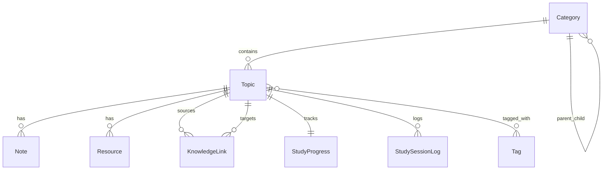

# HỆ THỐNG ĐẶC TẢ TÍNH NĂNG TOÀN DIỆN (FEATURE SPECIFICATION)
## Dashboard Nghiên Cứu Phật Học & Huyền Học (Knowledge OS)
**Phiên bản:** 2.0.0-PROD  
**Trạng thái:** DRAFT FOR REVIEW  
**Mục tiêu:** Hệ thống hóa và chuyển đổi nền tảng thành Second-Brain Research OS đạt chuẩn Production-Ready, thân thiện với người dùng phi kỹ thuật (Non-tech scholars).

---

## 1. PHẠM VI (SCOPE) & MỤC TIÊU PHI CHỨC NĂNG (NON-GOALS)

### 1.1. In-Scope (Nằm trong phạm vi triển khai)
1. **Trải nghiệm Non-tech & Feedback UI/UX**:
   - Breadcrumbs điều hướng đa tầng (Tam Tạng $\rightarrow$ Abhidhamma $\rightarrow$ 89 Tâm).
   - Skeleton Loading states cho toàn bộ các chế độ xem (Chủ đề, Ghi chú, Biểu đồ, Thư viện).
   - Empty states trang trọng, giàu cảm hứng học thuật với nút hành động nhanh (CTA).
   - Command Palette (`Ctrl/Cmd + K`) tra cứu và kích hoạt tác vụ tức thời.
   - Bộ lọc đa chiều (Domain, Category, Tags, Study Status).
   - Chế độ giao diện Sáng / Tối (Theme Light/Dark) bảo vệ thị giác khi đọc kinh điển ban đêm.
   - Bảng phím tắt toàn năng (`?` hoặc `Shift + /`).
2. **Persistence & Data Integrity**:
   - Chuyển đổi dữ liệu từ `localStorage` sang hệ quản trị PostgreSQL thông qua Prisma ORM.
   - Migration an toàn (Safe Migrations, Zero-Downtime, không làm mất dữ liệu người dùng).
   - Idempotent Seed nạp sẵn kho tri thức chuẩn mực (89 Tâm Vi Diệu Pháp, 64 Quẻ Dịch, Kỳ Môn Độn Giáp, Phong Thủy Loan Đầu - Lý Khí).
   - Zod Schema Validation bảo vệ toàn bộ API endpoints và luồng Import/Export dữ liệu.
   - 1-Click Backup / Restore (Định dạng JSON chuẩn hóa, Markdown, và Obsidian Vault .zip).
3. **Biểu đồ Tri Thức Tương Tác (Enhanced Knowledge Graph)**:
   - Thuật toán gom cụm (Clustering) phân định rõ Phật Học (Sắc Vàng Cam) và Huyền Học (Sắc Lam Tím).
   - Lưu trữ tọa độ bố cục (Layout persistence).
   - Tìm kiếm trực tiếp trên Graph và xuất ảnh độ phân giải cao (PNG, SVG, JSON).
4. **Hệ Thống Ôn Tập Trí Nhớ Gián Đoạn (Spaced Repetition SM-2)**:
   - Thuật toán SuperMemo-2 tối ưu theo chu kỳ lặp lại đường cong quên lãng Ebbinghaus.
   - Hàng đợi ôn tập hàng ngày (Due Review Queue), đồng hồ học tập thông minh Pomodoro/Stopwatch.
   - Báo cáo phân tích năng suất học tập và độ duy trì trí nhớ.
5. **Mobile & Cross-Platform Usability**:
   - Giao diện đáp ứng 100% trên thiết bị di động với Bottom Navigation Bar mượt mà, cảm ứng vuốt chạm trực quan.

### 1.2. Non-Goals (Không nằm trong phạm vi)
- Không biến nền tảng thành mạng xã hội nhiều người dùng (Multi-tenant social network).
- Không tự động kích hoạt các mô hình AI tính phí khi chưa có sự xác nhận của người dùng.
- Không thay đổi các thuật ngữ học thuật Pali/Hán đã được định danh chuẩn mực trong cơ sở tri thức gốc.

---

## 2. DATA CONTRACT & SCHEMA CHI TIẾT (PRISMA / TYPESCRIPT)

### 2.1. Entity Relationship Overview

### 2.2. Data Contracts (Zod & TypeScript Schema)

#### Category
- `id`: `string` (UUID hoặc tiền tố `cat-`)
- `name`: `string` (Min 1, Max 100 chars)
- `slug`: `string` (Kebab-case duy nhất)
- `type`: `'phat-hoc' | 'huyen-hoc'`
- `parentId`: `string | null`
- `description`: `string?`
- `icon`: `string?` (Tên icon Lucide)
- `color`: `string?` (Mã HEX)

#### Topic
- `id`: `string` (UUID hoặc `topic-timestamp`)
- `title`: `string` (Min 2, Max 255 chars)
- `slug`: `string`
- `categoryId`: `string` (Foreign Key đến Category)
- `type`: `'phat-hoc' | 'huyen-hoc'`
- `parentId`: `string | null`
- `description`: `string`
- `content`: `string` (Markdown)
- `tags`: `string[]`
- `studyProgress`: `StudyProgress`
- `links`: `KnowledgeLink[]`
- `createdAt`: `ISO Date string`
- `updatedAt`: `ISO Date string`

#### StudyProgress (SM-2 Fields)
- `topicId`: `string` (Unique)
- `status`: `'not_started' | 'in_progress' | 'completed' | 'reviewing'`
- `progress`: `number` (0 đến 100)
- `interval`: `number` (Số ngày giữa các lần ôn, $\ge 0$)
- `easeFactor`: `number` (Hệ số dễ dàng, $\ge 1.3$, mặc định 2.5)
- `repetitions`: `number` (Số lần nhớ liên tiếp, $\ge 0$)
- `nextReview`: `ISO Date string?`
- `lastStudied`: `ISO Date string?`
- `timeSpent`: `number` (Tổng phút học)
- `totalNotes`: `number`

#### Note
- `id`: `string` (UUID hoặc `note-timestamp`)
- `topicId`: `string`
- `title`: `string`
- `content`: `string` (Markdown)
- `type`: `'study' | 'insight' | 'question' | 'summary'`
- `isPrivate`: `boolean` (Default `false`)
- `tags`: `string[]`
- `createdAt`: `ISO Date string`
- `updatedAt`: `ISO Date string`

#### Resource
- `id`: `string`
- `topicId`: `string`
- `title`: `string`
- `url`: `string?` (URL hợp lệ)
- `filePath`: `string?`
- `type`: `'book' | 'article' | 'video' | 'audio' | 'pdf'`
- `author`: `string?`
- `notes`: `string?`
- `createdAt`: `ISO Date string`

---

## 3. HÀNH VI XỬ LÝ LỖI (ERROR BEHAVIOR & RESILIENCE)

1. **Lỗi Kết Nối Mạng / Máy Chủ**:
   - Khi API backend không khả dụng, hệ thống tự động kích hoạt **Offline Fallback Mode**: tiếp tục đọc/ghi vào `localStorage` và lưu cờ cảnh báo `unsynced_changes`.
   - Hiển thị Toast thông báo trạng thái ngoại tuyến mà không chặn tương tác người dùng.
2. **Lỗi Import Dữ Liệu Hỏng (Corrupted JSON / Invalid Files)**:
   - Mọi file tải lên đều phải đi qua Zod Schema Validation trước khi ghi vào State/Database.
   - Nếu xảy ra lỗi cú pháp hoặc thiếu trường bắt buộc, hiển thị modal báo cáo lỗi chi tiết: chỉ rõ dòng/trường bị sai, từ chối nạp và giữ nguyên 100% dữ liệu hiện tại (Zero Data Loss).
3. **Lỗi AI Service Quota / Missing Key**:
   - Khi không có `GEMINI_API_KEY` hoặc chạm Rate Limit, hệ thống hiển thị hướng dẫn cấu hình rõ ràng, kích hoạt gợi ý ngoại tuyến từ điển Pali/Hán sẵn có mà không làm crash ứng dụng.

---

## 4. TIÊU CHÍ CHẤP NHẬN (ACCEPTANCE CRITERIA) THEO TỪNG TÍNH NĂNG

### Feature 1: Command Palette & Navigation (`Ctrl/Cmd + K`)
- **AC1.1**: Nhấn phím `Ctrl + K` (Windows/Linux) hoặc `Cmd + K` (macOS) từ bất kỳ màn hình nào sẽ mở Command Palette trong vòng dưới 50ms.
- **AC1.2**: Người dùng có thể tìm kiếm theo tên chủ đề, ghi chú, lệnh chuyển tab hoặc hành động nhanh ("Thêm chủ đề", "Ôn tập SM-2", "Đổi giao diện").
- **AC1.3**: Hỗ trợ điều hướng bằng bàn phím (`Arrow Up`, `Arrow Down`, `Enter` để chọn, `Escape` để đóng).

### Feature 2: Spaced Repetition Engine (SM-2)
- **AC2.1**: Cho điểm chất lượng ôn tập $Q \in [0, 5]$.
  - Nếu $Q < 3$: `repetitions` reset về 0, `interval` reset về 1 ngày, `easeFactor` giảm tối đa xuống 1.3.
  - Nếu $Q \ge 3$: `repetitions` tăng 1; lần 1: `interval = 1`, lần 2: `interval = 6`, lần $n$: `interval = round(interval * easeFactor)`.
- **AC2.2**: `getReviewQueue(topics)` trả về chính xác danh sách các chủ đề có `nextReview <= hiện tại` hoặc trong cùng ngày.

### Feature 3: Data Import / Export An Toàn
- **AC3.1**: Xuất file JSON đầy đủ chứa tất cả bảng dữ liệu kèm metadata phiên bản.
- **AC3.2**: Import file JSON lạ: Hệ thống kiểm tra Zod Schema; nếu hợp lệ, cập nhật state; nếu không hợp lệ, trả về lỗi chi tiết mà không ghi đè dữ liệu cũ.
- **AC3.3**: Xuất gói ZIP Obsidian chứa đúng cấu trúc thư mục `Phat-Hoc/`, `Huyen-Hoc/`, `Ghi-Chu/`, file `00_Map_Of_Content.md` và các liên kết hai chiều `[[Wiki Links]]`.

### Feature 4: Tối Ưu Tốc Độ Tìm Kiếm
- **AC4.1**: Tốc độ tìm kiếm toàn văn trên 1,000 chủ đề & ghi chú đạt thời gian phản hồi dưới 200ms.
