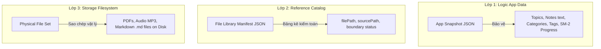

# SỔ TAY VẬN HÀNH SAO LƯU & KHÔI PHỤC DỮ LIỆU
## (Backup & Restore Operator Runbook — Knowledge OS)

**Mã tài liệu:** `RUNBOOK-BK-001`  
**Phiên bản:** `1.0.0`  
**Ngày ban hành:** `2026-08-25`  
**Phạm vi áp dụng:** Toàn bộ học giả, nhà nghiên cứu và quản trị viên vận hành hệ thống Knowledge OS.

---

## 1. PHẠM VI & NGUYÊN TẮC AN TOÀN CỐT LÕI

> [!IMPORTANT]
> **3 NGUYÊN TẮC AN TOÀN BẤT DI BẤT DỊCH TRONG VẬN HÀNH:**
> 1. **Snapshot JSON bảo vệ dữ liệu logic trong ứng dụng:** Chứa danh mục, chủ đề, ghi chú, thẻ, liên kết tri thức và tiến độ ôn tập SM-2. Snapshot **KHÔNG** chứa file PDF, âm thanh hay video nhị phân (Zero Binary Ingestion).
> 2. **Manifest bảo vệ metadata tham chiếu đường dẫn:** Chứa danh mục kiểm toán các đường dẫn tệp cục bộ trên máy tính để phục vụ việc kiểm tra và sao chép.
> 3. **Physical File Set (Tệp vật lý) phải được sao chép riêng:** Người vận hành **bắt buộc** phải sao chép thư mục tệp gốc trên ổ đĩa (`Knowledge-Library/` hoặc Obsidian Vault) sang ổ cứng ngoài hoặc đám mây độc lập. Việc chỉ có Snapshot JSON **chưa phải là bản sao lưu hoàn chỉnh**.

---

## 2. KIẾN TRÚC 3 LỚP SAO LƯU (3-LAYER ARCHITECTURE)

Hệ thống phân tách rõ ràng trách nhiệm của 3 thành phần sao lưu:

| Lớp Sao Lưu | Tệp Sinh Ra / Nguồn | Nội Dung Chứa Đựng | Cách Khôi Phục |
| :--- | :--- | :--- | :--- |
| **Lớp 1: App Snapshot JSON** | `knowledge-os-snapshot-*.json` | Toàn bộ dữ liệu logic, quan hệ thực thể, tiến độ ôn tập SM-2. | Nạp qua tính năng Khôi phục (Import) trong ứng dụng. |
| **Lớp 2: File Library Manifest JSON** | `file-library-manifest-*.json` | Bảng kê danh mục đường dẫn tệp, phân loại hợp lệ / thất lạc / ngoài thư viện. | Dùng đối chiếu, kiểm tra tính đầy đủ của thư mục tệp vật lý. |
| **Lớp 3: Physical File Set** | Thư mục `Knowledge-Library/` hoặc Obsidian Vault | Các tệp `.pdf`, `.mp3`, `.mp4`, `.md` gốc trên ổ đĩa máy tính. | Sao chép thủ công (Copy/Paste) hoặc dùng công cụ đồng bộ (rsync, Time Machine). |

---

## 3. QUY TRÌNH SAO LƯU TRƯỚC KHI THAY ĐỔI LỚN (PRE-CHANGE BACKUP PROCEDURE)

Trước khi thực hiện cập nhật hệ thống, nâng cấp phiên bản hoặc sửa đổi dữ liệu hàng loạt:

1. **Bước 1 — Xuất App Snapshot JSON:**
   - Mở modal **Quản Lý Dữ Liệu & Sao Lưu** (icon `Database` ở góc trên).
   - Chọn tab **"Xuất JSON"**.
   - Bấm nút **"Tải Xuống Bản Sao Lưu Máy Chủ (.json)"**.
   - Kiểm tra tệp tải về có tiền tố `knowledge-os-snapshot-YYYY-MM-DD.json`.
2. **Bước 2 — Xuất File Library Manifest JSON:**
   - Chọn tab **"Kiểm toán tệp & Manifest"**.
   - Kiểm tra ô **"Đường dẫn thư mục tệp gốc trên máy"** (ví dụ: `/Users/researcher/Knowledge-Library`).
   - Bấm nút **"Tải Xuống Bảng Kê Manifest (.json)"**.
3. **Bước 3 — Sao chép Thư mục Tệp Vật lý:**
   - Sử dụng Finder / File Explorer hoặc Terminal sao chép toàn bộ thư mục `Knowledge-Library/` và Obsidian Vault sang ổ cứng sao lưu hoặc thư mục lưu trữ ngoài.

---

## 4. QUY TRÌNH KIỂM TRA MỨC ĐỘ SẴN SÀNG SAO LƯU (BACKUP READINESS CHECK)

Tại tab **"Kiểm toán tệp & Manifest"**, quan sát báo cáo kiểm toán thời gian thực:

- **Tổng số tệp tham chiếu (Total References):** Tổng số `filePath` trong tài liệu và `sourcePath` trong ghi chú.
- **Tệp chưa xác minh (Unverified):** Số tệp ở trạng thái chờ kiểm chứng trên ổ đĩa.
  > [!NOTE]
  > **Giới hạn Web Sandbox:** Trình duyệt web không thể tự ý quét ổ đĩa của người dùng do chính sách bảo mật sandbox. Trạng thái `unverified` là bình thường và an toàn trong chế độ web, **không được coi là lỗi hệ thống**.
- **Tệp thất lạc (Missing):** Số tệp có đường dẫn nhưng không tồn tại trên ổ đĩa. Cần xác định lại đường dẫn hoặc di chuyển tệp về đúng vị trí.
- **Tệp ngoài thư viện gốc (Outside Library):** Các tệp nằm ngoài thư mục `canonicalLibraryRoot` (ví dụ: nằm tại Desktop hoặc Downloads). Khuyến nghị gom tệp về `Knowledge-Library/` để tránh bị sót khi sao lưu.

---

## 5. QUY TRÌNH DIỄN TẬP KHÔI PHỤC TRONG BỘ NHỚ (RESTORE DRILL PROCEDURE)

Diễn tập khôi phục (Restore Drill) giúp kiểm tra tính hợp lệ và xem trước tác động của bản sao lưu **hoàn toàn trong bộ nhớ (In-Memory Dry Run)**, cam kết **không ghi đè hay thay đổi bất kỳ dữ liệu thật nào**:

1. Mở modal **Quản Lý Dữ Liệu & Sao Lưu**, chuyển sang tab **"Khôi phục"**.
2. Tại mục **"1. Nạp Tệp Bản Sao Lưu Snapshot (.json)"**, chọn tệp snapshot cần kiểm tra (hoặc tệp fixture `valid-snapshot.json`).
3. Hệ thống sẽ tự động:
   - Thẩm định cấu trúc JSON và mã băm SHA-256 Checksum.
   - Chạy mô phỏng Restore Drill trong bộ nhớ đệm (RAM).
4. Quan sát thẻ màu chàm **"Diễn Tập Khôi Phục (Restore Drill - In-Memory Dry Run)"**:
   - Kiểm tra huy hiệu **"Mô phỏng an toàn"**.
   - Xem bảng biến động thực thể: `Chủ đề (+Δ)`, `Ghi chú (+Δ)`, `Tài liệu (+Δ)`.
5. Đổi qua lại giữa 2 chế độ **"Gộp Dữ Liệu (Merge)"** và **"Thay Thế Toàn Bộ (Replace)"** để xem sự khác biệt về số lượng thực thể sau mô phỏng.

---

## 6. CÁCH ĐỌC & PHÂN TÍCH KẾT QUẢ XEM TRƯỚC (RESTORE PREVIEW)

Bảng phân tích tác động mô phỏng hiển thị các chỉ số:

- **Chế độ Gộp Dữ Liệu (Merge Mode):**
  - Giữ nguyên dữ liệu hiện có trong ứng dụng.
  - Thêm mới các thực thể chưa có (dựa trên ID hoặc Slug).
  - Cập nhật thông tin các thực thể trùng khớp.
  - Biến động hiển thị dạng số dương (ví dụ: `+2 chủ đề`, `+5 ghi chú`).
- **Chế độ Thay Thế Toàn Bộ (Replace Mode):**
  - Xóa toàn bộ dữ liệu đang có trên máy chủ và thay thế 100% bằng dữ liệu trong snapshot.
  - Biến động hiển thị số lượng thực thể mới sẽ có sau khi xóa cũ.

---

## 7. QUY TRÌNH KHÔI PHỤC DỮ LIỆU THẬT (LIVE RESTORE EXECUTION)

> [!CAUTION]
> **CHỈ THỰC HIỆN BƯỚC NÀY KHI ĐÃ CÓ XÁC NHẬN CHÍNH THỨC VÀ ĐÃ XUẤT BẢN SAO LƯU PHÒNG NGỪA.**

1. Chọn chế độ khôi phục mong muốn:
   - Nếu chọn **"Gộp Dữ Liệu (Merge)"**: Bấm nút **"Thực Hiện Gộp Dữ Liệu"**.
   - Nếu chọn **"Thay Thế Toàn Bộ (Replace)"**:
     - Cửa sổ cảnh báo rủi ro cao màu đỏ (Confirmation Gate) sẽ xuất hiện.
     - Người vận hành **bắt buộc phải gõ chính xác cụm từ:** `XÁC NHẬN THAY THẾ`.
     - Nút **"Thực Hiện Thay Thế Dữ Liệu"** mới được kích hoạt.
2. Bấm nút thực hiện khôi phục.
3. Chờ thông báo thành công: *"Khôi phục dữ liệu thành công! Trạng thái đã được nạp lại."* Modal sẽ tự động đóng sau 1.5 giây.

---

## 8. QUY TRÌNH XỬ LÝ CÁC TRẠNG THÁI KIỂM TOÁN BẤT THƯỜNG

| Trạng Thái | Ý Nghĩa Kỹ Thuật | Hành Động Xử Lý Khuyến Nghị |
| :--- | :--- | :--- |
| `unverified` | Tệp chưa được xác minh do giới hạn sandbox trình duyệt. | Không cần can thiệp nếu đường dẫn đúng. Khuyến nghị sao chép toàn bộ thư mục tệp vật lý khi backup. |
| `missing` | Đường dẫn được ghi nhận nhưng tệp không tồn tại. | Mở thẻ tài liệu/ghi chú, kiểm tra lại tên tệp hoặc sao chép tệp vào đúng thư mục chỉ định. |
| `outside_library` | Tệp nằm ngoài thư mục `canonicalLibraryRoot`. | Di chuyển tệp vào thư mục `Knowledge-Library/PDF/` hoặc `Notes/` và cập nhật lại đường dẫn trong ứng dụng. |
| `unspecified` | Tài liệu là URL trực tuyến, không có đường dẫn tệp cục bộ. | Không yêu cầu tệp cục bộ trên máy. |

---

## 9. QUY TRÌNH SAO LƯU OBSIDIAN VAULT

1. Đảm bảo toàn bộ ghi chú nghiên cứu có `sourcePath` trỏ đến thư mục Obsidian Vault (ví dụ: `/Users/researcher/Obsidian/Buddhism-Vault/Notes/`).
2. Xuất Snapshot JSON của Knowledge OS để lưu trữ liên kết tri thức và tiến độ học tập.
3. Sử dụng công cụ sao lưu (Git, rsync, hoặc phần mềm đồng bộ) để sao lưu toàn bộ thư mục `.obsidian/` và các tệp `.md` trong Vault.

---

## 10. KIỂM THỬ XÁC MINH SAU KHÔI PHỤC (SMOKE TEST)

Sau khi khôi phục thành công, người vận hành cần kiểm tra nhanh:
1. **Kiểm tra Danh mục & Chủ đề:** Các danh mục chính (Phật Học, Huyền Học, v.v.) và các chủ đề con hiển thị đầy đủ trên cây chủ đề (TopicTree) và Dashboard.
2. **Kiểm tra Ghi chú & Tài liệu:** Mở một ghi chú và một tài liệu để kiểm tra nội dung hiển thị, đường dẫn `sourcePath` và `filePath`.
3. **Kiểm tra Spaced Repetition (SM-2):** Kiểm tra trạng thái học tập và dự báo thẻ ôn tập trong tab Tiến Độ (Progress).
4. **Kiểm tra Health Badge:** Biểu tượng trạng thái kết nối cơ sở dữ liệu ở góc trên hiển thị màu xanh lá (`Online / Healthy`).

---

## 11. KẾ HOẠCH KHẮC PHỤC SỰ CỐ & ROLLBACK (ROLLBACK PLAN)

Nếu xảy ra sự cố dữ liệu không mong muốn sau khi khôi phục:
1. **Bước 1:** Mở lại modal **Quản Lý Dữ Liệu & Sao Lưu**, chuyển sang tab **"Khôi phục"**.
2. **Bước 2:** Chọn tệp Snapshot JSON đã xuất ở **Bước 3 (Pre-change Backup)**.
3. **Bước 3:** Chọn chế độ **"Thay Thế Toàn Bộ (Replace)"**, nhập `XÁC NHẬN THAY THẾ` và tiến hành nạp lại trạng thái ban đầu.
4. **Bước 4:** Nếu cơ sở dữ liệu gặp lỗi kết nối máy chủ, hệ thống sẽ tự động kích hoạt chế độ dự phòng LocalStorage (Dual-Tier Resilience) để bảo vệ phiên làm việc của học giả.

---

## 12. BẢNG KÝ XÁC NHẬN CỦA NGƯỜI VẬN HÀNH (OPERATOR SIGN-OFF CHECKLIST)

| STT | Hạng Mục Kiểm Tra | Kết Quả (Đạt / Không Đạt) | Ghi Chú |
| :---: | :--- | :---: | :--- |
| 1 | Đã xuất App Snapshot JSON trước khi thao tác | [ ] ĐẠT | Tệp: `........................` |
| 2 | Đã xuất File Library Manifest JSON | [ ] ĐẠT | Tệp: `........................` |
| 3 | Đã sao chép thư mục tệp vật lý (PDF/Audio/Vault) | [ ] ĐẠT | Vị trí: `.....................` |
| 4 | Đã chạy Restore Drill (In-Memory Dry Run) xem trước số liệu | [ ] ĐẠT | Biến động khớp dự kiến |
| 5 | Đã hoàn thành khôi phục và vượt qua Smoke Test | [ ] ĐẠT | Health Badge: Xanh lá |

**Chữ ký Người Vận Hành (Operator):** `......................................`  
**Ngày thực hiện:** `...... / ...... / 202...`
