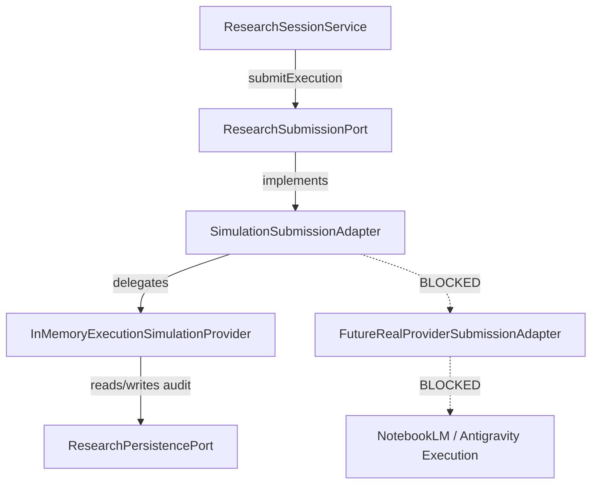

# Phase 6.2 — Provider Submission Port & Execution-Plane Boundary Summary

**Date:** 2026-09-24  
**Scope:** Phase 6.2 — Provider Submission Port (`ResearchSubmissionPort`), Request/Result Typed Contract (`ResearchSubmissionRequest`, `ResearchSubmissionResult`), and `SimulationSubmissionAdapter` with strict default-deny boundary.

---

## 1. Objectives & Scope Enforced

Phase 6.2 formalizes an independent submission boundary separating the Control Plane from the Execution Plane:
1. **Submission Port Interface:** `ResearchSubmissionPort` with `submit(request: ResearchSubmissionRequest): Promise<ResearchSubmissionResult>`.
2. **Typed Execution Request/Result Contracts:** Discriminated union `AcceptedResearchSubmissionResult` (`kind: "accepted"`) and `RejectedResearchSubmissionResult` (`kind: "rejected"`).
3. **Simulation Submission Adapter:** `SimulationSubmissionAdapter` implementing `ResearchSubmissionPort`, delegating exclusively to `ExecutionSimulationProvider`.
4. **Strict Default-Deny Execution Boundary:**
   - Any request with `mode !== "simulation_only"` is blocked with `status: "SIMULATED_BLOCKED"`, `code: "SIMULATION_BLOCKED"`.
   - Any request with `allowSideEffects !== false` is blocked with `status: "SIMULATED_BLOCKED"`, `code: "SIMULATION_BLOCKED"`.
   - Any request with `handoff.sideEffectsAllowed !== false` is blocked.
5. **No Real Provider Execution:** Zero invocations of `NotebookLM`, `Antigravity`, `Google Cloud`, external network sockets, or real credentials.

---

## 2. Contracts Implemented

### 2.1 Submission Request & Result (`executionSubmissionContract.ts`)

```typescript
export type ResearchSubmissionMode =
  | "simulation_only"
  | "real_execution";

export type ResearchSubmissionRequest = {
  readonly handoff: ResearchExecutionHandoff;
  readonly mode: "simulation_only";
  readonly allowSideEffects: false;
};

export type AcceptedResearchSubmissionResult = {
  readonly kind: "accepted";
  readonly mode: "simulation_only";
  readonly simulation: true;
  readonly submissionId: string;
  readonly correlationId: string;
  readonly providerId: string;
  readonly tool:
    | "research_create_workspace"
    | "research_ingest_sources"
    | "research_generate_audio";
  readonly status: "SIMULATED_ACCEPTED" | "SIMULATED_REPLAY";
  readonly sideEffectsAllowed: false;
  readonly providerCallMade: false;
  readonly networkCallMade: false;
  readonly credentialAccessed: false;
  readonly handoffFingerprint: string;
  readonly createdAt: string;
};

export type RejectedResearchSubmissionResult = {
  readonly kind: "rejected";
  readonly mode: "simulation_only";
  readonly simulation: true;
  readonly submissionId: string;
  readonly correlationId: string;
  readonly providerId: string;
  readonly tool:
    | "research_create_workspace"
    | "research_ingest_sources"
    | "research_generate_audio";
  readonly status: "SIMULATED_REJECTED" | "SIMULATED_BLOCKED";
  readonly sideEffectsAllowed: false;
  readonly providerCallMade: false;
  readonly networkCallMade: false;
  readonly credentialAccessed: false;
  readonly handoffFingerprint: string;
  readonly createdAt: string;
  readonly failure: {
    readonly code:
      | "INVALID_HANDOFF"
      | "APPROVAL_REQUIRED"
      | "IDEMPOTENCY_CONFLICT"
      | "CAPABILITY_UNSUPPORTED"
      | "PERSISTENCE_UNAVAILABLE"
      | "SIMULATION_BLOCKED";
    readonly message: string;
  };
};

export type ResearchSubmissionResult =
  | AcceptedResearchSubmissionResult
  | RejectedResearchSubmissionResult;
```

### 2.2 Submission Port Interface (`researchSubmissionPort.ts`)

```typescript
export interface ResearchSubmissionPort {
  submit(
    request: ResearchSubmissionRequest
  ): Promise<ResearchSubmissionResult>;
}
```

---

## 3. Adapter Dependency Graph



---

## 4. Default-Deny & Isolation Proof

1. **Request Mode:** Only `"simulation_only"` allowed at runtime; any `"real_execution"` is blocked with `SIMULATED_BLOCKED`.
2. **Side-Effects Guard:** `allowSideEffects: false` and `sideEffectsAllowed: false` strictly enforced.
3. **Zero Provider Coupling:** `SimulationSubmissionAdapter` does not import `NotebookLMEnterpriseProvider`, `AntigravityProvider`, `ResearchOrchestrator`, or `ProviderRegistry`.
4. **Zero Process / Network Capability:** No child processes spawned, no HTTP/socket connections, no credentials accessed.

---

## 5. Test Verification

- `tests/unit/research-submission-port.test.ts` (20/20 tests passed)
- `tests/unit/research-submission-contract.test.ts` (20/20 tests passed)
- `tests/unit/simulation-submission-adapter.test.ts` (10/10 tests passed)
- Full Provider & Submission Suite (27 test files, 442/442 tests passed)
- Legacy Provider Adapters Suite (13 test files, 127/127 tests passed)
- TypeScript Typecheck (`tsc --noEmit`): 0 errors
