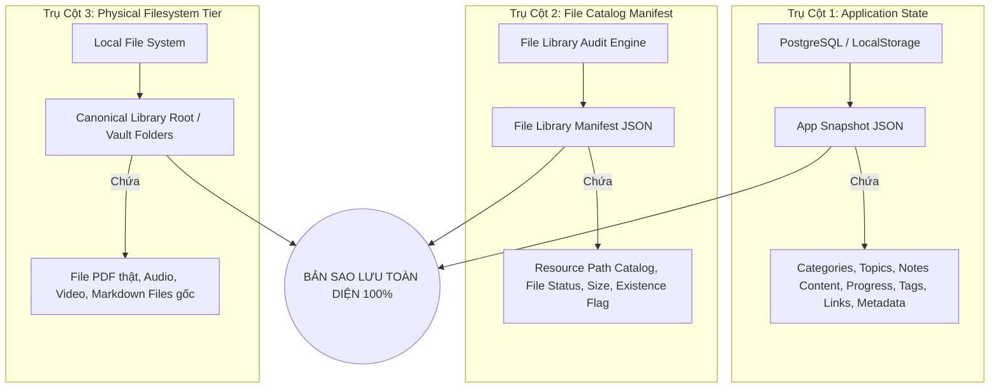

# ADR-017: Kiến Trúc Thư Viện Tệp Vật Lý & Kiểm Toán Sao Lưu (File Library & Backup Architecture)

> **Trạng thái:** Proposed (Đang trình duyệt)  
> **Người đề xuất:** Staff Software Engineer / Technical Architect  
> **Ngày quyết định:** 2026-08-25  
> **Phạm vi tác động:** File references (`Resource.filePath`, `Note.sourcePath`), Backup & Restore Architecture, Data Management Modal, Manifest Generator  

---

## 1. Bối Cảnh (Context)

Hệ thống Knowledge OS đang phục vụ công tác khảo cứu học thuật chuyên sâu (Phật học, Huyền học, Triết học, v.v.). Người dùng làm việc với khối lượng lớn tài liệu nghiên cứu:
- Sách, giáo trình, bài báo khoa học định dạng PDF.
- Bản dịch, ghi chú dạng tệp tin Markdown trên máy.
- Các tài liệu âm thanh, video bài giảng.

Từ Phase 1 (ADR-011), hệ thống đã thiết lập nguyên tắc kiến trúc cốt lõi: **Zero Binary Ingestion** (không lưu trữ tệp nhị phân dung lượng lớn vào PostgreSQL Database hay LocalStorage). Cơ sở dữ liệu và Snapshot JSON chỉ lưu trữ **Metadata** kèm trường chuỗi `filePath?: string`.

Tuy nhiên, mô hình hiện tại tồn tại khoảng trống kiến trúc:
1. **Thiếu sự tách bạch rõ ràng về Nguồn Chân Lý (Source of Truth):** Người dùng có thể lầm tưởng việc "Xuất bản sao lưu Snapshot JSON" là đã sao lưu toàn bộ các tệp PDF thật. Khi chuyển máy tính, nếu đường dẫn bị đứt gãy, các tài liệu sẽ không thể truy cập.
2. **Chưa có cơ chế Kiểm Toán Đường Dẫn (Path Audit Engine):** Hệ thống không kiểm tra xem tệp trỏ bởi `filePath` có thực sự tồn tại trên ổ đĩa hay không (`exists` vs `missing`), hoặc có nằm đúng trong thư mục thư viện chuẩn của người dùng hay không (`outside_library`).
3. **Chưa có Bảng Kê Kiểm Toán Tệp Tin (File Library Manifest):** Thiếu công cụ tổng hợp danh mục đường dẫn tệp vật lý để phục vụ các kịch bản sao lưu thủ công bằng tay (copy folder) hoặc sao lưu tự động (rsync / script).

---

## 2. Quyết Định Kiến Trúc (Architectural Decisions)

### 2.1. Phân Định Nguồn Chân Lý (Source of Truth Disambiguation)

Hệ thống thiết lập mô hình **3 Trụ Cột Sao Lưu (3-Pillar Backup Architecture)**:

1. **Nguồn chân lý cho Trạng thái Ứng dụng (Application State):** Là **Application Snapshot JSON** (`backups/snapshot-*.json`).
2. **Nguồn chân lý cho Tệp Tin Vật Lý (Physical Files):** Là **Hệ thống tệp tin cục bộ (Local Filesystem)** tại thư mục thư viện gốc của người dùng.
3. **Cầu nối Kiểm toán (Audit Bridge):** Là **File Library Manifest JSON** (`backups/file-library-manifest.json`), đóng vai trò bản đồ kê khai mọi tài liệu vật lý đang được ứng dụng tham chiếu.

### 2.2. Không Lưu Trữ Binary Trong Database (Why NOT Binary-in-Database)

Quyết định duy trì nguyên tắc **Zero Binary Ingestion** vì:
- **Hiệu năng & Khả năng mở rộng:** Cơ sở dữ liệu SQLite/PostgreSQL và LocalStorage sẽ bị phình to (bloat) nếu lưu hàng trăm file PDF dung lượng từ 10MB đến 100MB+, gây chậm chạp nghiêm trọng cho truy vấn tìm kiếm, filter, render UI và làm quá tải giới hạn bộ nhớ client (15MB Snapshot limit).
- **Quyền riêng tư & Quản lý của Người Dùng:** Học giả thường lưu trữ thư viện sách cá nhân trên thư mục riêng (Google Drive, iCloud, NAS, Obsidian Vault). Việc để file ở filesystem giúp họ dễ dàng đọc bằng các trình đọc PDF chuyên dụng (Adobe Reader, Preview, Zotero) mà không bị phụ thuộc vào app.
- **Blast Radius thấp:** Không yêu cầu migration cột `bytea / BLOB`, không cần cấu hình S3/MinIO server phức tạp ở giai đoạn này.

### 2.3. Trạng Thái Kiểm Toán Đường Dẫn (File Reference Status Taxonomy)

Mỗi tham chiếu tệp vật lý được phân loại qua trạng thái runtime:
- **`exists`**: Đường dẫn hợp lệ và tệp tồn tại thực tế trên ổ đĩa.
- **`missing`**: `filePath` được khai báo nhưng không tìm thấy tệp trên ổ đĩa (broken reference).
- **`outside_library`**: Tệp tồn tại nhưng nằm ngoài thư mục `canonicalLibraryRoot` được cấu hình.
- **`unspecified`**: Resource dạng Web URL thuần túy, không có `filePath`.

### 2.4. Khả Năng Tương Thích & Tính Thuận Nghịch (Reversible / Two-Way Door)

- **Type Safety & Backward Compatibility:** `Resource.filePath` và `Note.sourcePath` là các trường tùy chọn (`optional`).
- Các hàm audit và manifest builder được thiết kế dạng **Pure Functions** (không mutate dữ liệu gốc, không ghi đè cấu trúc DB, có thể chạy ở cả môi trường Node CLI lẫn Browser runtime).
- Nếu người dùng chưa thiết lập `canonicalLibraryRoot`, hệ thống sẽ sử dụng thư mục hiện hành hoặc bỏ qua bước kiểm tra `outside_library` mà không gây lỗi.

---

## 3. Các Phương Án Đã Cân Nhắc (Alternatives Considered)

| Phương Án | Ưu Điểm | Nhược Điểm | Kết Luận |
| :--- | :--- | :--- | :--- |
| **A. Lưu BLOB PDF vào Database** | Dữ liệu gom vào 1 nơi | DB phình to, backup snapshot nặng hàng GB, vỡ giới hạn 15MB, blast radius cao | ❌ **BÁC BỎ** |
| **B. Tích hợp Cloud Storage (S3 / MinIO)** | Lưu trữ tập trung | Đòi hỏi hạ tầng cloud phức tạp, tốn chi phí vận hành, mất tính riêng tư offline | ❌ **BÁC BỎ Ở GIAI ĐOẠN NÀY** |
| **C. Filesystem-First + Metadata Catalog Manifest (Được chọn)** | Tách bạch rõ ràng, blast radius cực thấp, kiểm toán chính xác, backup thân thiện | Người dùng cần backup cả thư mục file vật lý khi đổi máy | ✅ **CHẤP THUẬN (ADR-017)** |

---

## 4. Hướng Dẫn Vận Hành & Checklist Sao Lưu (Backup Checklist)

Một quy trình sao lưu toàn diện tiêu chuẩn gồm 3 bước:
1. **Bước 1 — Xuất Snapshot Ứng Dụng:** Tải về tệp `snapshot-YYYYMMDDTHHMMSSZ-xxxxxxxx.json` (chứa toàn bộ ghi chú, chủ đề, tiến độ SM-2).
2. **Bước 2 — Xuất Bảng Kê Thư Viện Tệp:** Tải về tệp `file-library-manifest.json` (chứa danh sách kiểm toán đường dẫn file PDF/Media).
3. **Bước 3 — Sao Chép Thư Mục Tệp Vật Lý:** Sao lưu toàn bộ thư mục thư viện tệp gốc (hoặc Vault) theo đường dẫn liệt kê trong manifest.
