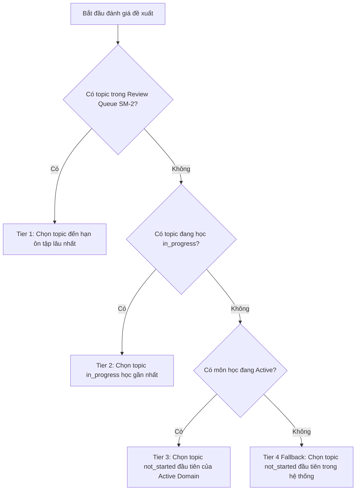

# UX Spec: Learning-First Overview & Multi-Disciplinary Study Control Tower

- **Phase**: Phase 13
- **Status**: Draft (Approved for Specification)
- **Target Context**: `DashboardHome.tsx`, `Sidebar.tsx`, `Navbar.tsx`, `src/lib/learningStateSelectors.ts`
- **Domain Scope**: Học đa môn song song (Đông y, Tiếng Trung, Tiếng Anh, Phật học, Huyền học...)

---

## 1. Problem Statement

Hiện tại, giao diện Overview và App Shell của Knowledge OS đang đóng vai trò là một **"Kho lưu trữ / Catalog quản lý tri thức"** hơn là một **"Bàn điều khiển học tập đa môn"** (Learning Control Tower). 

Khi người học mở ứng dụng để học hàng ngày:
1. **Quá tải nhận thức (Cognitive Overload)**: Sidebar và Header hiển thị dàn trải các công cụ chuyên sâu (Tài liệu kiến trúc, Từ điển thuật ngữ, Ma trận phân tích, Cầu nối Obsidian/NotebookLM/Handoff) ngang hàng với các tác vụ học tập thường xuyên.
2. **Không trả lời được câu hỏi cốt lõi**: *"Hôm nay tôi nên học gì?"* và *"Môn học trọng tâm đang dừng ở đâu, bài tiếp theo là gì?"*.
3. **Thẻ môn học (Domain Cards) bị tĩnh và thiên về thống kê số lượng**: Chỉ hiển thị tổng số topic và thanh % hoàn thành danh mục, thiếu thông tin về trạng thái học (đang học, duy trì, tạm dừng), bài học kế tiếp (Next Step) và nút hành động nhanh.
4. **Trùng lặp vai trò**: Sidebar và Overview đều có danh sách domain và công cụ tìm kiếm, làm loãng trọng tâm hành động.

---

## 2. Goals & Non-Goals

### Goals
- Chuyển trọng tâm của Overview từ "Quản lý tri thức" sang **"Điều phối học tập đa môn"**.
- Trả lời ngay 3 câu hỏi của người học trong vòng **3 giây** đầu tiên khi mở app.
- Xây dựng **Priority Rules v1** mang tính tất định (deterministic) và dựa trên chứng cứ (evidence-based) để đề xuất bài học trong ngày.
- Phân tầng lại Sidebar thành 3 nhóm rõ rệt: **Học tập** (Tầng 1) $\rightarrow$ **Tri thức** (Tầng 2) $\rightarrow$ **Công cụ** (Tầng 3).
- Tinh gọn Header: chuyển các nút tích hợp ngoại vi vào tầng nhận thức thứ cấp, đưa CTA học tập lên vị trí nổi bật.
- Cung cấp **Resume Queue** giúp tiếp tục phiên học dở dang chỉ với 1-click.
- Giữ blast radius thấp, không làm xáo trộn cấu trúc dữ liệu nền tảng.

### Non-Goals
- **Không** xây dựng thêm công cụ từ điển mới hay tài liệu kỹ thuật mới ở phase này.
- **Không** thay đổi schema cơ sở dữ liệu (Prisma / API endpoints / types lõi) trừ khi thêm các derived helper selectors.
- **Không** biến ứng dụng thành một LMS/Flashcard cứng nhắc làm mất tính năng liên kết nghiên cứu sâu (Graph, Notes, Resources).
- **Không** xóa bỏ các công cụ chuyên sâu (Matrices, Lexicon, Docs) mà chỉ sắp xếp chúng ở tầng nhận thức thấp hơn.

---

## 3. Ba Câu Hỏi Cốt Lõi Khi Mở App (3-Second Rule)

1. **Hôm nay học gì?** (Today Focus): Bài học hoặc phần ôn tập nào cần thực hiện ngay lúc này để giữ mạch tiến độ?
2. **Môn trọng tâm đang ở đâu?** (Priority Domain & Next Step): Lĩnh vực chính (ví dụ: Đông y hay Tiếng Trung) đang học đến chương/bài nào và bước tiếp theo là gì?
3. **Bài học dở dang cần tiếp tục?** (Resume Queue): Những chủ đề nào đang học dở (in-progress) với tiến độ cụ thể để quay lại ngay?

---

## 4. New Information Hierarchy (5 Khối Lõi của Overview)

```
+-----------------------------------------------------------------------------------+
| KHỐI 1: TODAY RECOMMENDATION & ACTION HERO                                        |
| "Hôm nay học gì" - Đề xuất tất định (Due SM-2 Reviews / Active Topic / Next Step) |
| [ Nút: Bắt đầu học ngay (1-Click Timer) ]   [ Nút: Xem chi tiết bài học ]        |
+-----------------------------------------------------------------------------------+
| KHỐI 2: PRIORITY DOMAIN & ACTIVE FOCUS                                            |
| Môn học ưu tiên hiện tại (ví dụ: Đông Y / Tiếng Trung)                            |
| Trạng thái: Đang theo học • Lần cuối học: 2 giờ trước • Bài tiếp theo: Bát Cương   |
+-----------------------------------------------------------------------------------+
| KHỐI 3: LEARNING STATE CARDS (GRID ĐA MÔN)                                        |
| [ Đông Y (Active) ]     [ Tiếng Trung (Active) ]     [ Phật Học (Maintenance) ]   |
| Next: Biện chứng        Next: HSK 4 Ngữ pháp         Next: Duy Thức Tam Thập Tụng  |
| ⏱ 14.5 giờ • Học ngay    ⏱ 8.2 giờ • Học ngay         ⏱ 32.0 giờ • Ôn tập         |
+-----------------------------------------------------------------------------------+
| KHỐI 4: RESUME QUEUE & RECENT STUDY FLOW                                          |
| Hàng đợi tiếp tục học các bài dở dang (In-Progress) kèm % hoàn thành & Recency    |
+-----------------------------------------------------------------------------------+
| KHỐI 5: UTILITY SECTION (CÔNG CỤ PHỤ TRỢ Ở TẦNG THẤP)                             |
| Lối tắt nhanh tới: Ma trận phân tích, Từ điển thuật ngữ, Docs kiến trúc, Graph   |
+-----------------------------------------------------------------------------------+
```

---

## 5. Định Nghĩa 3 UI Entities Chính

### 5.1. Today Recommendation (Khối 1)
- **Mục tiêu**: Đưa ra 1 khuyến nghị học tập duy nhất, rõ ràng, không bắt người dùng phải lựa chọn giữa hàng chục danh mục.
- **Dữ liệu hiển thị**: Tên chủ đề, Tên môn học (Domain Tag), Lý do đề xuất (Ví dụ: *"Đến hạn ôn tập SM-2"* hoặc *"Đang học dở (45%)"* hoặc *"Bài kế tiếp trong lộ trình Đông y"*), Thời gian đã tích lũy.
- **Hành động chính**:
  - `Học ngay`: Kích hoạt `StudyTimerModal` gắn sẵn topicId.
  - `Mở bài`: Điều hướng tới `TopicDetail`.

### 5.2. Learning State Card (Khối 3)
- **Mục tiêu**: Thay thế "Catalog/Stat Cards" cũ (chỉ đếm số topic) bằng card phản ánh **trạng thái học thực tế** của từng môn.
- **Trạng thái môn học (`domainStatus`)**:
  - `Active` (Đang học tích cực): Có bài học trong vòng 7 ngày qua hoặc có bài đang ở trạng thái `in_progress`.
  - `Maintenance` (Duy trì / Ôn tập): Đã hoàn thành phần lớn (>80%), có bài trong `reviewQueue`.
  - `Dormant` (Tạm dừng): Chưa có hoạt động học trong >14 ngày.
- **Dữ liệu hiển thị trên Card**:
  - Tên lĩnh vực + Icon nhận diện chuẩn hóa.
  - Badge trạng thái (`Đang học`, `Cần ôn tập`, `Tạm dừng`).
  - **Bài học tiếp theo (Next Step)**: Tên bài học cụ thể cần học kế tiếp.
  - **Thời gian học tích lũy thực tế**: Định dạng giờ/phút (ví dụ `14h 30m`).
  - Nút hành động trực tiếp: `Vào học` (mở bài tiếp theo) hoặc `Khảo sát` (lọc topic tree theo domain).

### 5.3. Resume Queue Item (Khối 4)
- **Mục tiêu**: Bắt lại dòng chảy học tập (learning flow) ngay lập tức.
- **Tiêu chuẩn vào hàng đợi**: Các topic có `studyProgress.status === 'in_progress'` hoặc `'reviewing'` và `progress < 100`.
- **Sắp xếp**: Theo thời gian học gần nhất (`lastStudied` hoặc `updatedAt` giảm dần).
- **Dữ liệu hiển thị**: Tên topic, Tên môn học, % tiến độ thanh bar, Thời gian học gần nhất (ví dụ: *"Học hôm qua"*), nút Play học tiếp.

---

## 6. Priority Rules v1 (Thuật Toán Đề Xuất Tất Định & Evidence-Based)

Thuật toán đề xuất cho **Today Recommendation** tuân theo chuỗi đánh giá thác nước (cascade hierarchy) hoàn toàn tất định:



### Quy tắc chi tiết:
1. **Tier 1 (Spaced Review Due - Ưu tiên cao nhất)**:
   - Điều kiện: `reviewQueue.length > 0`.
   - Lựa chọn: Topic có `nextReview` xa nhất về quá khứ (overdue nhiều nhất) hoặc có `interval` ngắn nhất.
   - Lý do đề xuất (Badge text): `"Ôn tập định kỳ SM-2 (Củng cố trí nhớ)"`.
2. **Tier 2 (In-Progress Active Study)**:
   - Điều kiện: Có topic có `studyProgress.status === 'in_progress'` và `studyProgress.progress > 0` và `studyProgress.progress < 100`.
   - Lựa chọn: Topic có `lastStudied` (hoặc `updatedAt`) gần đây nhất.
   - Lý do đề xuất (Badge text): `"Tiếp tục bài học dở dang ([X]% hoàn thành)"`.
3. **Tier 3 (Next Step in Priority Domain)**:
   - Điều kiện: Tìm domain có hoạt động gần đây nhất (Recent Active Domain). Tìm topic có `status === 'not_started'` đầu tiên trong domain đó theo thứ tự cây topic.
   - Lựa chọn: Topic kế tiếp trong lộ trình môn học ưu tiên.
   - Lý do đề xuất (Badge text): `"Bài học tiếp theo trong lộ trình [Tên Môn]"`.
4. **Tier 4 (Fallback - Cold Start)**:
   - Điều kiện: Toàn bộ hệ thống chưa có tiến độ (0%).
   - Lựa chọn: Topic đầu tiên hiển thị (`visibility !== 'hidden'`) của môn học đầu tiên.
   - Lý do đề xuất (Badge text): `"Khởi động lộ trình học tập mới"`.

---

## 7. Data Assumptions & Data Gaps

Liệt kê minh bạch ranh giới dữ liệu giữa hiện trạng và thiết kế mới:

| Nhóm Dữ Liệu | Trường / Khái Niệm | Hiện Trạng (State Hiện Tại) | Xử Lý Trong Phase 13 (v1) |
| :--- | :--- | :--- | :--- |
| **Đã có sẵn (Existing State)** | `Topic.studyProgress.status` | Đầy đủ (`not_started`, `in_progress`, `completed`, `reviewing`) | Sử dụng trực tiếp |
| | `Topic.studyProgress.progress` | Đầy đủ ($0 - 100\%$) | Sử dụng trực tiếp |
| | `Topic.studyProgress.timeSpent` | Đầy đủ (phút) | Sử dụng tính tổng thời gian học môn |
| | `Topic.studyProgress.lastStudied` | Đầy đủ (ISO date string) | Dùng tính Recency |
| | `Topic.studyProgress.nextReview` | Đầy đủ (ISO date string SM-2) | Dùng tính Review Queue |
| | `Topic.visibility` | Đầy đủ (`active`, `hidden`) | Lọc bỏ topic ẩn |
| | `Category.parentId` | Đầy đủ (Hệ thống phân cấp gốc) | Dùng nhóm Domain theo root category |
| **Dữ liệu phái sinh (Derived Data)** | `priorityDomain` | Chưa có field riêng | **Phái sinh**: Root category của topic được học gần đây nhất |
| | `nextStepTopic` | Chưa có field riêng | **Phái sinh**: Topic đầu tiên chưa xong trong root category |
| | `domainStatus` | Chưa có field riêng | **Phái sinh**: Dựa trên ngày học gần nhất ($<7$ ngày = Active, $>14$ ngày = Dormant) |
| | `domainTotalTimeSpent` | Chưa có field riêng | **Phái sinh**: Tổng `timeSpent` của toàn bộ topic thuộc root category |
| | `resumeQueue` | Chưa có selector riêng | **Phái sinh**: Danh sách topic `in_progress` sort theo `lastStudied` giảm dần |
| **Thiếu / Trì hoãn (Deferred to v2)** | *Pinned/Starred Domain* | Không có trường `isPinned` trên Category | **Deferred v2**: v1 dùng derived recency, không can thiệp schema |
| | *Strict Prerequisite Graph* | Có `KnowledgeLink.linkType='prerequisite'` nhưng chưa ràng buộc chặt | **Deferred v2**: v1 dùng thứ tự danh mục thay vì khóa học bắt buộc |
| | *Daily Target & Streak Days* | Chưa có bảng ghi nhận streak theo ngày | **Deferred v2**: v1 dùng tổng thời gian tích lũy và recency |

---

## 8. Sidebar Taxonomy Mới (Phân Tầng 3 Cấp)

Sidebar được tổ chức lại từ 2 nhóm lộn xộn thành **3 tầng rõ ràng**:

```
SIDEBAR
│
├── [ TẦNG 1: HỌC TẬP (Learning - Trọng tâm) ]
│   ├── Tổng quan (Dashboard)              [Icon: LayoutDashboard]
│   ├── Tiến độ & Ôn tập (Study/Review)    [Icon: TrendingUp + Badge Queue]
│   └── Cây chủ đề (Topics Tree)           [Icon: FolderTree + Badge Total]
│
├── [ TẦNG 2: TRI THỨC (Knowledge Base) ]
│   ├── Ghi chú học tập (Notes)            [Icon: FileText + Badge Count]
│   ├── Tài liệu & Giáo trình (Resources)  [Icon: Library + Badge Count]
│   ├── Bản đồ tri thức (Graph)            [Icon: Share2]
│   └── Tra cứu nâng cao (Search)          [Icon: Search]
│
├── [ TẦNG 3: CÔNG CỤ & TIỆN ÍCH (Tools & Scholar Suite) ]
│   ├── AI Hỗ trợ (AI Studio)              [Icon: Sparkles]
│   ├── Ma trận phân tích (Abhidharma)     [Icon: Brain]
│   ├── Mô hình hệ thống (Divination)      [Icon: Compass]
│   ├── Từ điển thuật ngữ (Lexicon)        [Icon: BookA]
│   └── Tài liệu kiến trúc (Docs)          [Icon: BookOpen]
│
└── [ FOOTER: LĨNH VỰC NGHIÊN CỨU & WIDGET THỜI GIAN ]
    ├── Lọc nhanh theo môn học (Root Categories)
    └── Widget thời gian thực học (Clock & Active Time)
```

---

## 9. Header Strategy Mới

- **Giảm nhiễu**:
  - Gom các nút tích hợp (`Obsidian`, `NotebookLM`, `Handoff`) thành 1 menu nhỏ gọn hoặc dạng icon tinh tế, không dùng các pill màu sắc chiếm spotlight.
- **Tăng cường CTA học tập**:
  - Đặt nút **"Tiếp Tục Học" (Quick Resume CTA)** kế bên Study Timer khi có bài đang học dở.
  - Giữ lại Timer pill với trạng thái hoạt động trực quan.
  - Huy hiệu Ôn tập (Spaced Review) chỉ nổi bật khi có bài đến hạn.

---

## 10. Định Nghĩa "Tiến Độ Học Thật" vs "Thống Kê Kho Tri Thức"

| Tiêu Chí | Thống Kê Kho Tri Thức (Catalog Metrics) | Tiến Độ Học Thật (Active Learning Metrics) |
| :--- | :--- | :--- |
| **Bản chất** | Đo lường độ lớn của kho tài liệu (Coverage). | Đo lường hành vi học và khả năng ghi nhớ thực tế. |
| **Chỉ số đo** | Tổng số chủ đề, số tài liệu PDF, số bài ghi chép. | Số phút thực học (`timeSpent`), tần suất học gần đây (`recency`). |
| **Độ hoàn thành** | Đánh dấu tick checkbox hoàn thành danh mục. | Khoảng cách ôn tập ngắt quãng SM-2 (`interval`, `easeFactor`). |
| **Tác động UX** | Tạo cảm giác choáng ngợp vì kho dữ liệu quá lớn. | Tạo động lực hoàn thành bài học kế tiếp ngay hôm nay. |

---

## 11. Xử Lý Trùng Lặp & Giảm Nhiễu (De-duplication)

1. **Khối Tìm kiếm**: Loại bỏ form tìm kiếm to bản ở giữa DashboardHome; người dùng sử dụng Search Bar trên Header hoặc thanh lệnh `⌘K` (Command Palette).
2. **Domain Navigation**:
   - Sidebar Domain List đóng vai trò **Bộ lọc ngữ cảnh** (Context Filter) để thu hẹp cây chủ đề.
   - Dashboard Learning State Cards đóng vai trò **Bàn điều khiển hành động** (Action Control) hiển thị bài tiếp theo và nút học.
3. **Widget thống kê**: Gom các chỉ số phân tán thành một dòng tóm tắt học tập súc tích trong Hero.

---

## 12. Success Criteria

1. **Deterministic Accuracy**: 100% đề xuất Today Recommendation tuân theo đúng thứ tự 4 Tier của Priority Rules v1 mà không bị null hoặc crash.
2. **Action Distance**: Người dùng có thể bắt đầu phiên học của môn trọng tâm chỉ trong **tối đa 1 cú click** từ trang Tổng quan.
3. **IA Clarity**: Sidebar phân chia chuẩn xác 3 tầng, không còn tình trạng công cụ chuyên sâu nằm lẫn với menu học tập chính.
4. **Mobile Usability**: Trên viewport hẹp, các khối hành động học tập hiển thị đầu tiên, không bị che khuất bởi các bảng thống kê cồng kềnh.
5. **Zero Breaking Changes**: Không làm hỏng các test suite hiện tại và không làm gián đoạn các modal tiện ích sẵn có.
