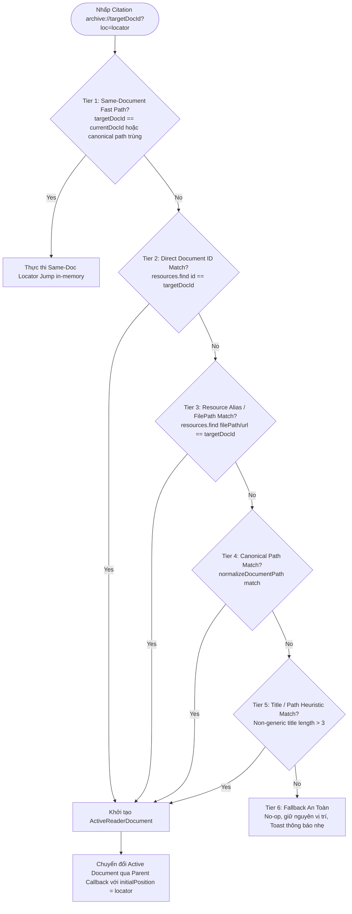

# Phase 19 Specification: Bidirectional Citation Deep-Link Navigation

## 1. Mục Tiêu & Bối Cảnh (Objective & Context)

Hệ thống Knowledge OS hỗ trợ trích xuất văn bản từ tài liệu đọc (Markdown, PDF, EPUB) và đính kèm trích dẫn học thuật vào Ghi chú (`Note`) và Hộp trích đoạn (`ResearchInboxItem`) theo định dạng:
```text
archive://{documentId}?loc={locator}
```
hoặc dưới dạng comment markdown / markdown link:
```markdown
> Trích dẫn nội dung...
> — *Tên Sách*, tr. 42 [Xem tài liệu](archive://doc-123?loc=42)
```

Mục tiêu của **Phase 19** là hiện thực hóa trải nghiệm **Điều Hướng Hai Chiều Hoàn Chỉnh (Bidirectional Citation Deep-Link Navigation)**:
- **Phạm vi triển khai lát cắt đầu tiên (Initial In-Scope Implementation)**:
  - Người dùng nhấp vào liên kết citation `archive://...` trong Tab **Ghi chú** (`notes`) của `ReaderSidebar` (bên trong `UnifiedResearchReader`).
  - Hệ thống tự động phân giải tài liệu nguồn theo thứ tự ưu tiên 5 cấp bậc, điều hướng same-document (in-memory) hoặc cross-document (thông qua orchestration callback).
  - Phân loại lỗi và xử lý fallback an toàn (Failure Taxonomy), bảo toàn ranh giới Read-Only của Obsidian Vault.
- **Phạm vi Hoãn lại / Chuẩn bị sẵn (Deferred / Future-Ready Surfaces)**:
  - `NoteReaderModal` và các bề mặt hiển thị ghi chú độc lập ngoài Reader (TopicDetail, NotesManager standalone list) được thiết kế kiến trúc sẵn sàng mở rộng (future-ready) nhưng **không** nằm trong phạm vi sửa đổi luồng production của lát cắt Green đầu tiên này.

---

## 2. Ràng Buộc Bất Biến (Architecture Invariants)

1. **Bất biến Định dạng Citation (Format Invariance)**:
   - Giữ nguyên 100% cú pháp citation hiện hành: `archive://{documentId}?loc={locator}` (hoặc `archive://{documentId}`).
   - Tuyệt đối không thay đổi schema cơ sở dữ liệu, localStorage schema, hoặc REST API contract.

2. **Ranh giới Chỉ Đọc Obsidian Vault (Read-Only Boundary)**:
   - Mọi hoạt động điều hướng citation, đọc ghi chú, mở tài liệu đính kèm chỉ thực hiện qua các endpoint đọc dữ liệu (`/api/obsidian/vault/attachment`, `/api/docs/raw`).
   - Tuyệt đối không ghi đè, tạo tệp, hoặc can thiệp vào cây thư mục tệp Obsidian Vault vật lý (tuân thủ ADR-064 / ADR-075 / ADR-076).

3. **An Toàn Bảo Mật & Sanitize (Safety & XSS Defense)**:
   - **Allowlist Scheme**: Chỉ chấp nhận `archive://` cho deep-link điều hướng nội bộ.
   - **Denylist Schemes**: Chặn đứng tuyệt đối `javascript:`, `data:`, `vbscript:`, `file:`.
   - **Locator Decoding**: Giải mã locator (`decodeURIComponent`) an toàn, loại bỏ ký tự điều khiển độc hại trước khi đưa vào DOM query selector hoặc adapter.

4. **Trạng thái Giao diện Nhất quán khi Chuyển Tài liệu (UI Consistency)**:
   - Khi chuyển sang tài liệu mới thành công: `scopedNotes`, `documentHighlights`, và `tocItems` tự động re-scope theo tài liệu mới.
   - Tab hiện tại trên `ReaderSidebar` (ví dụ: `notes`) được giữ nguyên, không tự ý reset làm phân tán tập trung của người dùng.

---

## 3. Thứ Tự Phân Giải Tài Liệu (5-Tier Document Resolution Order)

Hàm phân giải `resolveCitationTargetDocument(targetDocId, currentDocContext, resources)` tuân thủ nghiêm ngặt thứ tự ưu tiên 5 cấp độ:



1. **Tier 1 — Same-Document Fast Path**:
   - So sánh trực tiếp `targetDocId` với `currentDocumentId` hoặc so sánh canonical path (`normalizeDocumentPath(targetDocId) === normalizeDocumentPath(currentDocumentId)`).
   - Nếu trùng khớp: không nạp lại tài liệu, chỉ kích hoạt cơ chế nhảy locator nội bộ của adapter tương ứng.

2. **Tier 2 — Direct `documentId` Match**:
   - Tìm kiếm chính xác trong danh mục tài nguyên: `resources.find(r => r.id === targetDocId)`.

3. **Tier 3 — Resource Alias / FilePath Match**:
   - Tìm kiếm tài nguyên có `filePath` hoặc `url` trùng khớp với `targetDocId`.

4. **Tier 4 — Canonical Path Match**:
   - Chuẩn hóa cả `targetDocId` và `resource.filePath` qua `normalizeDocumentPath` (loại bỏ `vault:`, prefix `/api/obsidian/...`, giải mã URI) và so khớp case-insensitive.

5. **Tier 5 — Title & Filename Safe Heuristic (Last-resort)**:
   - So khớp tên file gốc (base name) hoặc tiêu đề không thuộc danh sách generic ID (`doc`, `pdf`, `epub`, `md`, `untitled`) với độ dài `> 3 ký tự`.

6. **Tier 6 — Unresolved Fallback**:
   - Nếu không thể phân giải: Không crash, không thay đổi tài liệu/vị trí hiện tại, hiển thị toast thông báo nhẹ nhàng (`aria-live="polite"`).

---

## 4. Chiến Lược Điều Hướng Locator Theo Định Dạng (Locator Strategy)

| Định dạng | Cấu trúc Locator | Cơ chế điều hướng trong Reader | Fallback khi Locator không tìm thấy |
|---|---|---|---|
| **Markdown (.md)** | `heading-id` hoặc slug | `containerRef.current.querySelector('[id="..."]')` $\rightarrow$ `scrollIntoView({ behavior: 'smooth', block: 'start' })` | Giữ nguyên đầu tài liệu, thông báo vị trí không khả dụng |
| **EPUB (.epub)** | `epubcfi(...)` hoặc Spine index | `rendition.display(cfi)` in-memory qua `EpubReaderAdapter` | Tự động fallback về `rendition.display(0)` an toàn |
| **PDF (.pdf)** | Số trang `pageNumber` (ví dụ `42`, `page=42`) | Phân tích số nguyên $\ge 1 \rightarrow$ cập nhật `currentPage` / `initialPage` cho viewer | Fallback về trang 1 nếu không hợp lệ |

---

## 5. Phân Loại & Xử Lý Lỗi (Failure Taxonomy & User Feedback)

| Mã lỗi | Tình huống | Hành vi hệ thống | Thông điệp thông báo người dùng |
|---|---|---|---|
| **ERR_MALFORMED_URI** | URI không đúng định dạng `archive://` hoặc chứa ký tự cấm | Không thực hiện điều hướng; giữ nguyên ngữ cảnh | `"Định dạng liên kết trích dẫn không hợp lệ"` |
| **ERR_MISSING_DOC_ID** | URI dạng `archive://` không có `documentId` | Không thực hiện điều hướng | `"Không tìm thấy mã tài liệu trong liên kết trích dẫn"` |
| **ERR_DOC_UNRESOLVED** | `documentId` không tồn tại trong thư viện / resources | Giữ nguyên tài liệu hiện tại, không đổi view | `"Không tìm thấy tài liệu nguồn tương ứng"` |
| **ERR_LOCATOR_MISSING** | Citation không có tham số `?loc=` | Mở tài liệu nguồn ở vị trí đầu trang (trang 1 / đầu bài) | `"Đã mở tài liệu nguồn (không có vị trí cụ thể)"` |
| **ERR_LOCATOR_NOT_FOUND**| Locator không tồn tại trong DOM/EPUB spine | Mở tài liệu ở vị trí đầu trang, không ném lỗi | `"Không tìm thấy vị trí trích đoạn trong tài liệu"` |
| **ERR_ADAPTER_FAILURE** | Adapter gặp sự cố khi scroll hoặc display CFI | Bắt lỗi qua ErrorBoundary / try-catch, không crash toàn trang | `"Không thể cuộn tới vị trí trích dẫn"` |

Tất cả thông báo phản hồi người dùng được đưa qua component Toast với thời gian hiển thị 2.5s và hỗ trợ thuộc tính trợ năng `aria-live="polite"`.
