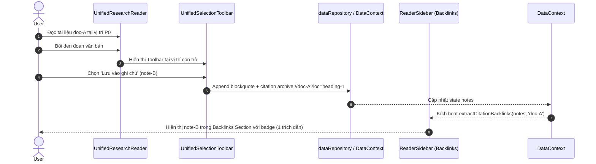
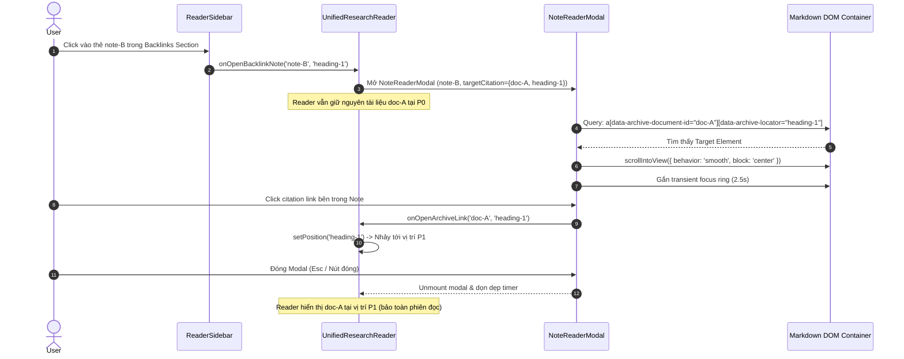

# Phase 22 — Bidirectional Research Loop Verification & Reader Release Hardening

## Status

Draft / Proposed

---

## 1. Mục tiêu (Goals)

Phase 22 tập trung vào việc **xác minh toàn diện chu trình nghiên cứu hai chiều (End-to-End Bidirectional Research Loop)** và **làm vững chắc vòng đời (Lifecycle Hardening)** của hệ thống Reader trước khi đóng gói phát hành (Release).

Mục tiêu cụ thể:
1. **Khép kín & Xác minh Chu trình Nghiên cứu Toàn trình (End-to-End Round-Trip):**
   - Đảm bảo luồng tạo citation từ Reader sang Note và luồng truy hồi từ Backlinks về Reader hoạt động trơn tru, liền mạch và bảo toàn nguyên vẹn ngữ cảnh.
2. **Lifecycle & Timing Hardening:**
   - Bảo vệ `NoteReaderModal` và `UnifiedResearchReader` trước các rủi ro về thời gian: unmount nhanh khi timer highlight đang chạy, DOM mount trễ do render bất đồng bộ, locator chứa ký tự đặc biệt, và bảo vệ reading position persistence.
3. **Chuẩn hóa Bộ Quality Gates và Phân loại Lỗi (Quality Gates & Failure Taxonomy):**
   - Thiết lập Tier 1 Blocking Gate cho Reader Subsystem (chạy trong < 10s, deterministic 100%) tách biệt với Tier 2 Informational Monitor của toàn bộ repository.
4. **Bảo đảm An Toàn Tuyệt Đối (Safety Invariants):**
   - 0 Vault write, 0 note mutation trong các luồng đọc/điều hướng, 0 schema change, 0 breaking change.

---

## 2. Phạm vi trong Scope (In Scope)

1. **Đặc tả Luồng Toàn Trình (Two Main Research Flows):**
   - **Luồng A (Citation Creation):** `Reader` $\rightarrow$ `Highlight/Excerpt Selection` $\rightarrow$ `Save to Note` $\rightarrow$ `Citation Persistence (archive://)` $\rightarrow$ `Backlinks Discovery`.
   - **Luồng B (Citation Retrieval & Precision Focus):** `ReaderSidebar Backlinks` $\rightarrow$ `Open NoteReaderModal` $\rightarrow$ `Occurrence Focus (Scroll + Transient Pulse)` $\rightarrow$ `Citation Click Jump Back to Reader` $\rightarrow$ `Close Modal` $\rightarrow$ `Preserve Source Reader Position`.
2. **Hardening Bộ Điều Khiển Giao Diện (UI Controller Hardening):**
   - `NoteReaderModal`: Quản lý timer highlight (`setTimeout`) bằng ref/effect cleanup, bảo vệ `CSS.escape` cho mọi ký tự đặc biệt trong locator.
   - `UnifiedResearchReader`: Đảm bảo đồng bộ `globalReadingPositionStore` khi chuyển đổi qua lại giữa modal và reader.
3. **Bộ Test Integration Chuyên Trách:**
   - Xây dựng `tests/integration/reader-loop-hardening.test.tsx` kiểm thử toàn trình 7 bước.
4. **Bộ Tài Liệu Kiến Trúc & Tiêu Chuẩn Release:**
   - `docs/specs/phase-22-bidirectional-research-loop-hardening.md`
   - `docs/adr/ADR-081-bidirectional-research-loop-verification-and-hardening.md`
   - `docs/gherkin/phase-22-bidirectional-research-loop.feature`
   - `docs/test-matrix/phase-22-reader-loop-hardening.md`

---

## 3. Explicit Non-Goals (Ngoài Phạm Vi)

1. Không thêm UI controls mới (không thêm nút Prev/Next occurrence stepper trong modal).
2. Không mở rộng backlinks sang Flashcards, Research Inbox hay Global Graph trong phase này.
3. Không xây dựng database index hoặc bộ nhớ cache tĩnh lưu vị trí citation.
4. Không thay đổi định dạng chuẩn: `archive://{documentId}?loc={locator}`.
5. Không thay đổi database schema, entity `Note`, `Resource`, `Topic`.
6. Không ghi dữ liệu vào Obsidian Vault (duy trì 100% read-only).
7. Không sửa đổi các subsystem legacy nằm ngoài phạm vi Reader.

---

## 4. Repository Baseline & Dependency Boundary

- **Base Commit:** `9134759 feat(reader): add backlink occurrence navigation in note context`
- **Các thành phần cốt lõi:**
  - `src/components/reader/UnifiedResearchReader.tsx`
  - `src/components/reader/ReaderSidebar.tsx`
  - `src/components/modals/NoteReaderModal.tsx`
  - `src/lib/readerBacklinksSelector.ts`
  - `src/lib/readerDocumentResolver.ts`
  - `src/lib/readingPositionUnified.ts`
  - `src/lib/markdownReadability.tsx`
  - `src/components/reader/UnifiedSelectionToolbar.tsx`

---

## 5. Mô tả Chi tiết Hai Luồng Nghiên Cứu Chính

### Luồng A — Citation Creation (Từ Đọc sang Lưu Trữ)

### Luồng B — Citation Retrieval & Occurrence Focus (Từ Trích Dẫn ngược về Đọc)

---

## 6. Hợp Đồng Kiểm Thử Giao Diện 7 Bước (7-Step Browser Sanity Contract)

Mỗi phiên xác minh tương tác browser đối với hệ thống Reader bắt buộc phải vượt qua 7 bước chuẩn:

1. **Bước 1 (Mở tài liệu nguồn):** Mở `UnifiedResearchReader` với tài liệu `doc-A` ở vị trí ban đầu $P_0$.
2. **Bước 2 (Trích xuất & Lưu citation):** Bôi đen đoạn văn, chọn lưu vào `note-B` với citation `archive://doc-A?loc=heading-1`.
3. **Bước 3 (Phát hiện Backlink động):** Mở Reader Sidebar Tab Notes $\rightarrow$ `note-B` xuất hiện ngay trong danh sách Backlinks với số lượng và snippet chính xác.
4. **Bước 4 (Mở Note Context Modal):** Click backlink `note-B` $\rightarrow$ `NoteReaderModal` mở ra đè lên Reader, Reader không bị unmount.
5. **Bước 5 (Focus Occurrence chính xác):** Modal tự cuộn đến phần tử trích dẫn khớp `loc=heading-1` và hiển thị transient visual ring.
6. **Bước 6 (Nhảy ngược lại Reader):** Click vào link trích dẫn trong note $\rightarrow$ Reader cập nhật vị trí đọc đến $P_1$.
7. **Bước 7 (Đóng Modal & Bảo toàn Trạng thái):** Đóng modal $\rightarrow$ Người dùng quay lại Reader tại đúng vị trí $P_1$, không bị reload, không mất context.

---

## 7. Phân Loại Lỗi (Failure Taxonomy)

| Phân Loại | Mức Độ | Mô Tả & Tiêu Chí | Biện Pháp Xử Lý |
|---|---|---|---|
| **Class A: Blocker / Subsystem Critical** | **Nghiêm trọng (Chặn Release)** | - Lỗi TypeScript / biên dịch. - Sai lệch định dạng citation (`archive://`). - Ghi đè hoặc chỉnh sửa trái phép Obsidian Vault. - Mất vị trí đọc hoặc crash khi mở/đóng modal. - Backlinks selector bỏ sót hoặc tính toán sai. | Bắt buộc khắc phục 100% trước khi chuyển sang bước release. |
| **Class B: Hardening / Resilience Defect** | **Trung bình (Resilience)** | - Rò rỉ timer khi unmount modal nhanh (< 100ms). - DOM query ném lỗi do locator chứa ký tự đặc biệt. - Môi trường headless thiếu method `scrollIntoView`. | Xử lý phòng vệ bằng optional chaining, cleanup hook, và `CSS.escape`. |
| **Class C: Legacy / Unrelated Noise** | **Thấp (Informational)** | - Test timing/mock flakiness trong các module legacy không liên quan (`FileViewer`, `notebooklm-studio`, `topic-duplicate`). | Cô lập hoàn toàn, không dùng làm rào cản chặn release Reader Subsystem. |

---

## 8. Bảng Quản Trị Rủi Ro (Risk Register)

| Rủi Ro Kỹ Thuật | Xác Suất | Mức Ảnh Hưởng | Cơ Chế Phòng Vệ & Giảm Thiểu |
|---|---|---|---|
| **1. Unmount Timer Race Condition** | Trung bình | Thấp | Sử dụng `useRef` lưu timer ID và gỡ bỏ sạch sẽ class highlight trong effect cleanup. |
| **2. Special Characters trong Locator DOM Query** | Thấp | Trung bình | Bọc toàn bộ query giá trị locator bằng `CSS.escape` với hàm fallback an toàn. |
| **3. Asynchronous Markdown Transclusion Render** | Thấp | Thấp | Chạy query occurrence trong `requestAnimationFrame` hoặc microtask để đảm bảo DOM đã gắn kết. |
| **4. Reading Position Race Condition** | Thấp | Cao | Sử dụng `globalReadingPositionStore` đơn nguồn chân lý trong RAM, cập nhật tức thì trước khi đóng modal. |

---

## 9. Quality Gates (Cổng Chất Lượng Release)

### Tier 1 — Blocking Release Gate (Bắt buộc 100% PASS)
1. `git diff --check` (0 issues).
2. `npm run typecheck` (`tsc --noEmit` — 0 errors).
3. **Reader Subsystem Test Suite** (thời gian chạy < 10 giây):
   - `tests/unit/reader-citation-backlinks-selector.test.ts`
   - `tests/unit/note-reader-archive-deeplink.test.tsx`
   - `tests/unit/reader-sidebar-citation-jump.test.tsx`
   - `tests/unit/reader-sidebar-document-notes.test.tsx`
   - `tests/integration/reader-bidirectional-citation.test.tsx`
   - `tests/integration/global-citation-orchestration.test.tsx`
   - `tests/integration/reader-loop-hardening.test.tsx`

### Tier 2 — Informational Monitor (Không Chặn Release)
- Chạy toàn bộ test suite repository (`npx vitest run`) phục vụ quan sát độ ổn định toàn hệ thống.

---

## 10. Tiêu Chí Hoàn Thành Phase 22 (Acceptance Criteria)

1. Luồng 2 chiều (A và B) được kiểm chứng qua integration test `tests/integration/reader-loop-hardening.test.tsx`.
2. `NoteReaderModal` có khả năng chịu tải tốt khi đóng/mở nhanh liên tục mà không sinh lỗi console hay unhandled timer exceptions.
3. Các locator chứa ký tự đặc biệt (`%`, `&`, `#`, `.`, `:`) được escape an toàn khi query DOM.
4. Đóng `NoteReaderModal` luôn bảo toàn phiên đọc hiện tại trong `UnifiedResearchReader`.
5. Toàn bộ Tier 1 Blocking Quality Gates đạt trạng thái xanh 100%.
