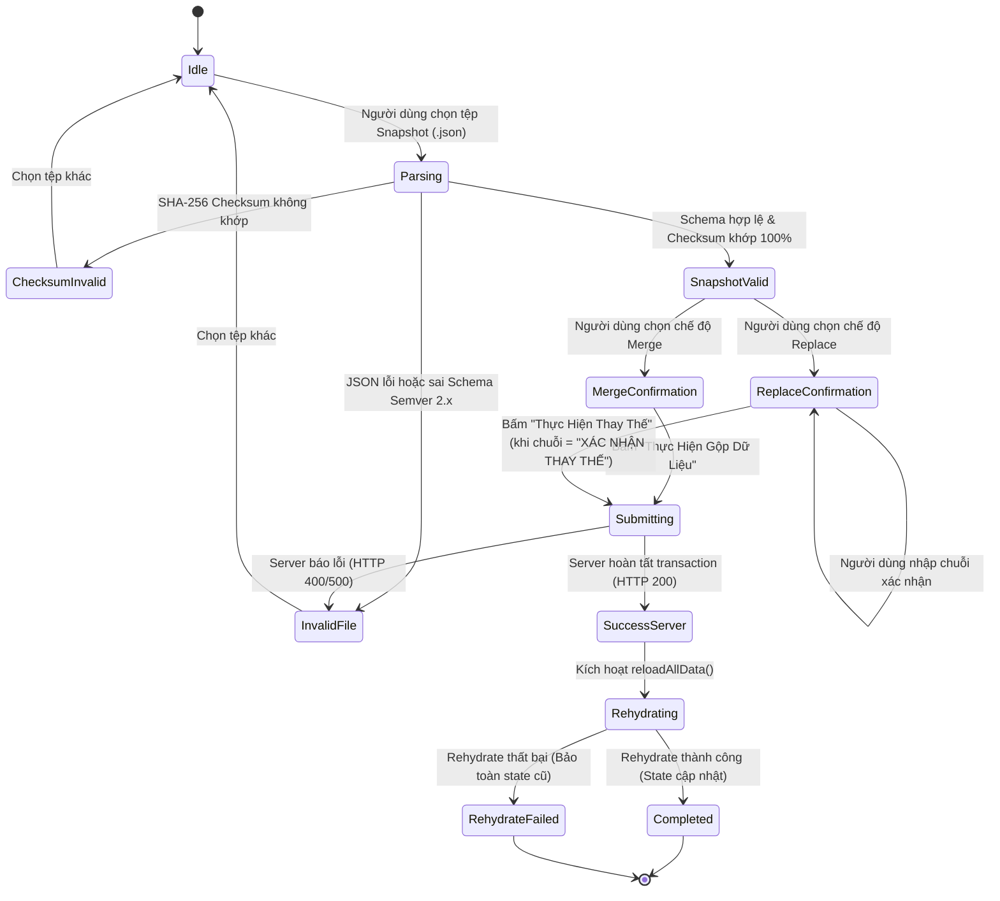

# 📋 ĐẶC TẢ KỸ THUẬT: PHASE 2C.4 — DATA MANAGEMENT MODAL & CONFIRMATION GATE UI
## Knowledge OS — Disaster Recovery, Snapshot Management & Real-Time Health

> **Trạng thái:** DRAFT / PENDING REVIEW (SPEC-FIRST)  
> **Tài liệu tham chiếu:** [`docs/architecture-decisions.md`](file:///Users/mr.chem/Documents/Lap-trinh/Dashboard-update/docs/architecture-decisions.md) (ADR-009) · [`docs/PROJECT_STATUS.md`](file:///Users/mr.chem/Documents/Lap-trinh/Dashboard-update/docs/PROJECT_STATUS.md)  
> **Kiến trúc:** Option A — Server-Authoritative Disaster Recovery with Client-Side Confirmation Gate

---

## 🎯 1. SCOPE IN & SCOPE OUT

### A. Phạm vi Thực hiện (Scope In)
1. **Server-Authoritative Snapshot Export:**
   - Tích hợp `dataRepository.exportBackupSnapshot()` để xuất snapshot chuẩn Semver 2.x có SHA-256 Checksum tất định.
   - Tải tệp sao lưu chuẩn hóa: `phat-hoc-huyen-hoc-snapshot-{YYYY-MM-DD}.json`.
2. **Snapshot File Parsing & Client-Side Validation:**
   - Nạp tệp `.json` từ máy người dùng.
   - Kiểm tra Schema bằng `BackupSnapshotSchema.safeParse`.
   - Tính toán và đối chiếu SHA-256 Checksum bằng Web Crypto API/`calculateBackupChecksum`.
   - Hiển thị bảng tóm tắt đối chiếu số lượng thực thể (Counts: Categories, Topics, Notes, Resources, Tags).
3. **Chế Độ Phục Hồi & Confirmation Gate:**
   - Hỗ trợ 2 chế độ:
     - **Merge (LWW):** Cập nhật gộp theo quy tắc Last-Write-Wins, giữ tiến độ học tập cao nhất.
     - **Replace (Full Atomic Replacement):** Thay thế toàn bộ dữ liệu máy chủ trong một transaction duy nhất.
   - **Confirmation Gate:** Chế độ `replace` bắt buộc người dùng nhập chính xác 100% chuỗi ký tự hoa: `XÁC NHẬN THAY THẾ` trước khi kích hoạt nút thực thi.
4. **Post-Restore Rehydration Lifecycle:**
   - Gọi `dataRepository.restoreBackupSnapshot({ snapshot, mode, confirmReplace })`.
   - Khi server trả về thành công, kích hoạt `reloadAllData()` để đồng bộ lại in-memory state của `DataContext`.
   - Xử lý cô lập lỗi khi rehydrate thất bại (`rehydrate_failed`): Bảo toàn 100% state cũ, không xóa dữ liệu, không ghi đè LocalStorage.
5. **Offline & Fallback Safety Notice:**
   - Hiển thị cảnh báo rõ ràng khi ứng dụng chạy ở chế độ offline thuần LocalStorage (`UNSUPPORTED_OFFLINE_OPERATION`).

### B. Phạm vi Loại trừ (Scope Out)
- ❌ KHÔNG sửa đổi Prisma schema hoặc chạy database migration.
- ❌ KHÔNG thay đổi hợp đồng REST API backend (`/api/backup/export`, `/api/backup/restore`, `/api/health/db`).
- ❌ KHÔNG cài đặt thêm thư viện/dependency bên ngoài.
- ❌ KHÔNG triển khai cơ chế Auto-Restore ngầm không có xác nhận của người dùng.
- ❌ KHÔNG lưu trữ mật khẩu, session token hoặc credentials trong snapshot.

---

## 🛡️ 2. INVARIANTS & RÀO CHẮN AN TOÀN

1. **Deterministic Checksum Invariant:** Snapshot tải lên bắt buộc phải có Checksum khớp 100% với SHA-256 tính từ dữ liệu canonical `data`. Nếu sai lệch $\rightarrow$ Chặn ngay ở Client trước khi gửi request lên Server.
2. **Confirmation String Invariant:** Chuỗi xác nhận cho Replace Mode phải khớp chính xác `XÁC NHẬN THAY THẾ` (phân biệt hoa thường, không thừa khoảng trắng).
3. **State Preservation Invariant:** Nếu quá trình nạp lại dữ liệu sau khôi phục (`reloadAllData()`) thất bại, state in-memory cũ phải được bảo toàn nguyên vẹn, không được reset về rỗng.
4. **Zero Page Reload Invariant:** Toàn bộ vòng đời Export, Restore, Rehydration diễn ra mượt mà trong Single Page Application (SPA) mà không yêu cầu F5 / tải lại trang trình duyệt.
5. **Zero Binary Ingestion Invariant:** Dữ liệu snapshot chỉ chứa chuỗi JSON và metadata, không chứa dữ liệu nhị phân base64.

---

## 🔄 3. RESTORE STATE MACHINE & UX STATES

### Chi tiết các trạng thái UX:
| State | Mô tả hiển thị | Hành vi tương tác |
| :--- | :--- | :--- |
| `idle` | Giao diện nạp tệp ban đầu | Nút chọn tệp sao lưu `.json` hoạt động |
| `parsing` | Đang đọc tệp và tính toán SHA-256 | Hiển thị spinner tải dữ liệu |
| `invalid_file` | Lỗi định dạng JSON hoặc sai Schema | Hiển thị alert đỏ, nút restore bị khóa |
| `checksum_invalid` | Lỗi SHA-256 Checksum không khớp | Hiển thị cảnh báo tính toàn vẹn bị vi phạm, khóa submit |
| `snapshot_valid` | Tệp hợp lệ, hiển thị bảng Counts | Cho phép chọn chế độ Merge hoặc Replace |
| `merge_confirmation` | Xem trước các bản ghi sẽ được gộp | Nút submit mở khóa sẵn sàng thực thi |
| `replace_confirmation` | Cảnh báo nguy hiểm (Destructive Gate) | Nút submit **bị khóa** cho đến khi nhập đúng `XÁC NHẬN THAY THẾ` |
| `submitting` | Đang gửi payload lên Server | Disable toàn bộ controls, hiển thị loading |
| `success_server` | Máy chủ xử lý thành công | Chuyển tiếp tự động sang Rehydrating |
| `rehydrating` | Đang làm tươi state React in-memory | Gọi `reloadAllData()` |
| `completed` | Toàn tất quy trình | Hiển thị banner xanh thông báo thành công |
| `rehydrate_failed` | Lỗi nạp dữ liệu cục bộ sau restore | Hiển thị cảnh báo vàng/đỏ, giữ nguyên dữ liệu in-memory hiện tại |

---

## ⚖️ 4. TRADE-OFFS & THIẾT KẾ ĐÁNH ĐỔI

1. **Confirmation Gate (Bắt buộc gõ phím thay vì chỉ bấm nút):**
   - *Đánh đổi:* Thêm 1 thao tác nhập liệu cho người dùng.
   - *Lợi ích:* Ngăn chặn 100% nguy cơ vô tình bấm nhầm làm xóa trắng toàn bộ dữ liệu nghiên cứu Phật học & Huyền học.
2. **Client-Side SHA-256 Checksum Verification:**
   - *Đánh đổi:* Tốn một lượng nhỏ CPU/RAM của trình duyệt để tính toán hash JSON trước khi upload.
   - *Lợi ích:* Fast-fail ngay tại máy khách trong vài mili-giây, tiết kiệm băng thông và bảo vệ backend khỏi các payload hỏng.
3. **Dual-Tier Offline Notice:**
   - *Đánh đổi:* Người dùng ở chế độ thuần LocalStorage không thể thực hiện disaster recovery của Server.
   - *Lợi ích:* Đảm bảo tính nhất quán dữ liệu (Data Consistency), ngăn ngừa phân kỳ dữ liệu giữa SQLite/LocalStorage và PostgreSQL máy chủ.

---

## 🎯 5. TIÊU CHÍ CHẤP NHẬN (ACCEPTANCE CRITERIA)

1. **Export Snapshot:** Tải về tệp JSON hợp lệ với `version: "2.0.0"`, `counts`, `checksum` và `data`.
2. **Client Checksum Guard:** Chặn đứng file bị sửa đổi nội dung với thông báo `SHA-256 Checksum mismatch`.
3. **Replace Gate:** Nút thực hiện Replace chỉ sáng lên khi nhập chính xác `XÁC NHẬN THAY THẾ`.
4. **Rehydration Flow:** Sau khi khôi phục thành công, danh sách chủ đề, ghi chú và tiến độ tự động cập nhật trên giao diện mà không cần reload trang.
5. **State Safety:** Khi ngắt kết nối mạng ngay lúc rehydrate, in-memory state cũ không bị biến mất.
6. **Health Polling:** Trạng thái kết nối máy chủ hiển thị rõ ràng trên UI.
