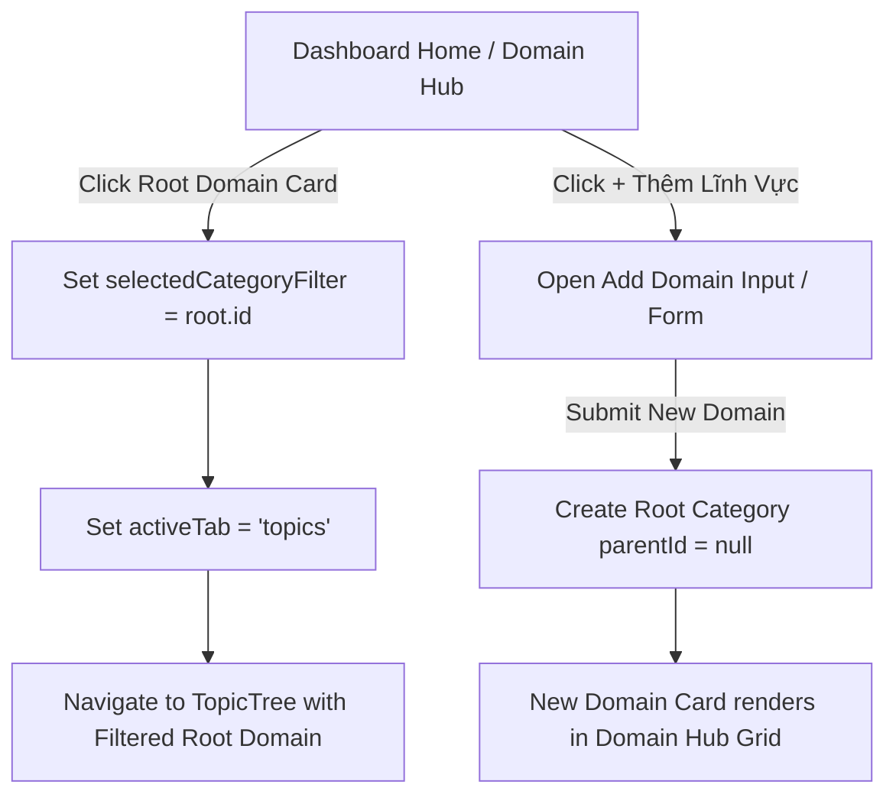

# Technical Specification: Phase 8A — Multi-Discipline Research Domain Hub (Dashboard Overview)

## 1. Problem Statement
Sau khi tái cấu trúc Sidebar (Phase 7D) để phân định rõ luồng công việc phổ quát và công cụ chuyên sâu, ứng dụng cần hoàn thiện trải nghiệm tại trang chủ (Dashboard) để biến trang này thành **Trung Tâm Lĩnh Vực Nghiên Cứu (Domain Hub)** đích thực của một Multi-Discipline Research Workspace.

Hiện tại:
- Khối Root Domain Cards trên Dashboard đã có tính năng render động qua `calculateRootCategoryStats`, nhưng giao diện vẫn còn mang tính thử nghiệm, thiếu sự dẫn dắt rõ ràng cho người dùng mở rộng sang các lĩnh vực khoa học, xã hội, kỹ thuật mới.
- Chưa có hành vi thêm nhanh lĩnh vực nghiên cứu trực tiếp tại Domain Hub.
- Cần chuẩn hóa hành vi lọc và chuyển hướng khi người dùng nhấp vào từng lĩnh vực để bảo đảm tính mượt mà, trực quan và không phá vỡ các khối tiện ích khác (SM-2 reviews, Tiến độ tuần này, Hoạt động gần đây).

---

## 2. Goals & Non-Goals

### 2.1. Goals
1. **Thiết lập Khối "Trung Tâm Lĩnh Vực Nghiên Cứu" (Domain Hub)**:
   - Trở thành tiêu điểm trực quan trên Dashboard với tiêu đề rõ ràng, phân cấp danh mục khoa học.
   - Mỗi Root Domain Card hiển thị đầy đủ: Tên lĩnh vực, Biểu tượng, Số lượng chủ đề (`X chủ đề`), Tiến độ hoàn thành (`Y% done`), Tóm lược phân ngành con/mô tả và CTA điều hướng trực quan (`Khảo sát →` / `Vào nghiên cứu →`).
2. **Hỗ trợ tạo mới & mở rộng Lĩnh vực Nghiên cứu (Add Domain CTA)**:
   - Hiển thị card hoặc nút hành động cho phép người dùng thêm ngay lĩnh vực nghiên cứu mới trực tiếp từ Dashboard.
3. **Luồng người dùng (User Flow) chuẩn xác**:
   - Click vào một Domain Card:
     1. Gán `selectedCategoryFilter = root.id`.
     2. Chuyển `activeTab = 'topics'`.
     3. Chuyển hướng người dùng vào cây chủ đề (`TopicTree`) đã được lọc sẵn theo toàn bộ nhánh con của lĩnh vực đó.
4. **Bảo toàn 100% các khối nghiệp vụ hiện hành**:
   - Khối thông báo ôn tập ngắt quãng (SM-2 review queue pill).
   - Card hệ thống "Đang học / Tiến độ tích lũy".
   - Khối "Tiến độ tuần này" và danh sách "Hoạt động gần đây" (Notes, Topics, Resources).

### 2.2. Non-Goals
1. **Không thay đổi Schema/DB**: Dữ liệu Category, Topic và quan hệ `parentId` giữ nguyên vẹn.
2. **Không hard-code thiên vị cho Phật học/Huyền học**: Mọi lĩnh vực người dùng tạo mới đều được đối xử bình đẳng và có giao diện chuẩn mực.
3. **Không chỉnh sửa Sidebar**: Phase 8A tập trung hoàn toàn vào bề mặt Dashboard.

---

## 3. Current vs Proposed Dashboard Behavior

### 3.1. Current Behavior
- Grid chứa Root Category Cards nằm ngay dưới banner nhưng chưa có header phân nhóm rõ rệt.
- Thẻ card lĩnh vực dùng màu sắc riêng cho 2 root mặc định (`phat-hoc`, `huyen-hoc`), các root mới dùng màu mặc định `sky`.
- Chưa có nút thêm nhanh lĩnh vực mới ngay trên Dashboard.

### 3.2. Proposed Domain Hub Behavior
- **Section Header**: `TRUNG TÂM LĨNH VỰC NGHIÊN CỨU` với mô tả định hướng không gian học thuật đa ngành.
- **Domain Cards Grid**:
  - Render đầy đủ các root categories (Phật Học, Huyền Học, và tất cả root categories do người dùng tạo thêm).
  - Thẻ card tương tác cao, hiển thị rõ số chủ đề, thanh tiến độ, nhãn tỷ lệ hoàn thành, danh sách các chuyên ngành con.
  - Card hoặc Action Button `+ Thêm lĩnh vực mới` cho phép khởi tạo nhanh domain.
- **System Metrics Card**:
  - Thẻ "Đang học & Tích lũy" hiển thị tổng thời gian học, số lượng ghi chú và tài liệu liên kết.

---

## 4. User Flow

---

## 5. Blast Radius & Affected Files
- `src/components/dashboard/DashboardHome.tsx` [MODIFY in Phase 8B]: Tinh chỉnh section header, domain card grid và action thêm domain.
- `tests/unit/phase8a-domain-hub-dashboard.test.tsx` [NEW]: Unit & integration tests kiểm chứng hành vi Domain Hub.
- `docs/specs/phase-8a-domain-hub-dashboard.md` [NEW]: Bản đặc tả kỹ thuật này.
- `docs/gherkin/phase-8a-domain-hub-dashboard.feature` [NEW]: Kịch bản BDD.

---

## 6. Rollback Strategy
Thay đổi thuần túy nằm ở tầng presentation của `DashboardHome.tsx`. Nếu cần hoàn tác, chỉ cần khôi phục lại component `DashboardHome.tsx` mà không để lại bất kỳ di chứng dữ liệu nào.
