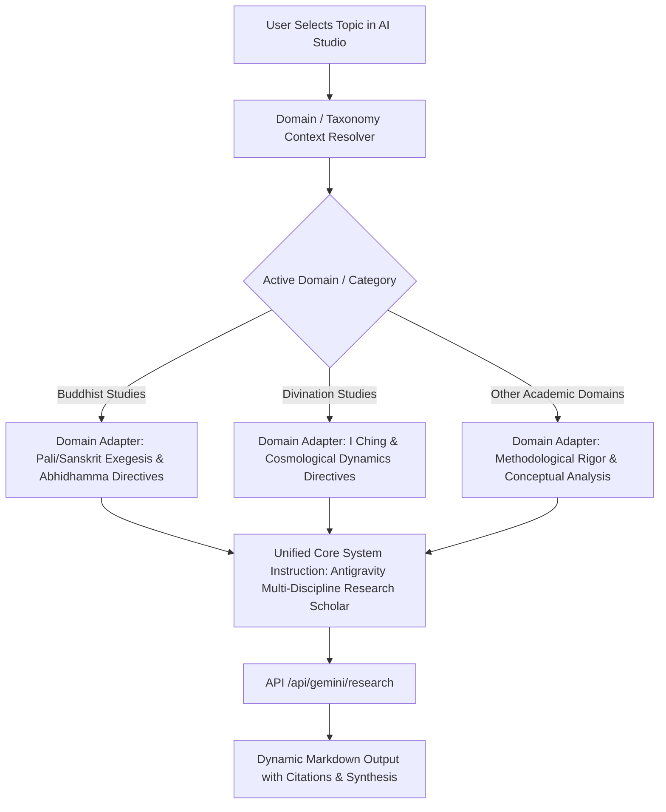

# Technical Specification: Phase AI-Studio-Neutralization (Universal Multi-Discipline AI Research Engine)

## 1. Problem Statement & Audit Findings

Lớp AI Research Studio và Antigravity AI layer hiện đang bị gắn cứng (domain bias) vào Phật học và Huyền học Đông phương ở 4 tầng cấu trúc:

1. **Presentation Layer (`src/components/ai/AIResearchStudio.tsx`)**:
   - Subtitle cố định: *"Trợ lý khảo cứu ngữ nghĩa sâu, phân tích Vi Diệu Pháp, Tam Tạng & Huyền học Đông phương"*.
   - Mode labels chỉ hiển thị: `Luận Tạng`, `Gốc Từ Pali/Hán`, `Đối Chiếu Dịch Lý`.
   - Preset Quick Prompts: 100% gợi ý về Vi Diệu Pháp, Tâm sở, Pali/Sanskrit/Hán cổ, 64 Quẻ Dịch, Citta Vīthi.
   - Topic Select Option format: `[{t.type === 'phat-hoc' ? 'Phật Học' : 'Huyền Học'}]` làm méo mó các topic thuộc domain mới (Khoa học, Kinh tế, Lịch sử, Triết học...).

2. **Research Modes Architecture**:
   - `scholar_analysis`, `pali_sanskrit_exegesis`, `cross_domain_link` được mô hình hóa theo trường phái cổ truyền thay vì theo các tác vụ nghiên cứu học thuật phổ quát (task archetypes).

3. **Prompt System Architecture (`src/lib/antigravity.ts` & `server.ts`)**:
   - System instruction định danh AI cố định là học giả chuyên sâu 2 kho tàng tư tưởng Phương Đông.
   - Section 1 và Section 6 của Handoff Bundle ép buộc quy tắc suy luận về Abhidhamma, Citta, Quẻ Dịch cho mọi topic.
   - `generateAntigravityPrompt` sinh prompt mặc định ép khuôn Phật học/Dịch học ngay cả khi topic là Kinh tế học hoặc Vật lý lượng tử.

4. **Storage Key Naming (`src/lib/antigravityPipeline.ts`)**:
   - `ANTIGRAVITY_HANDOFF_JOBS_STORAGE_KEY` hiện là `phat_hoc_antigravity_handoff_jobs_v1`.

---

## 2. Goals & Non-Goals

### 2.1. Goals
1. **Phổ quát hóa AI Research Studio thành Trợ lý Nghiên cứu Đa Lĩnh vực (Universal AI Research Assistant)**:
   - Giao diện trung tính, hiện đại, uyên bác và không áp đặt thế giới quan lên người dùng.
   - Hỗ trợ xuất sắc mọi lĩnh vực học thuật: Khoa học tự nhiên, Khoa học xã hội, Kinh tế, Triết học, Lịch sử, Kỹ thuật và cả Tôn giáo/Huyền học.
2. **Tổng quát hóa Research Modes (Universal Research Task Archetypes)**:
   - Phân loại chế độ AI theo bản chất tác vụ nghiên cứu:
     - `concept_analysis` (Phân tích Khái niệm & Cấu trúc luận)
     - `terminology_exegesis` (Khảo cứu Thuật ngữ & Ngữ nguyên)
     - `cross_domain_synthesis` (Đối chiếu & Tổng hợp Liên ngành)
   - Tương thích ngược 100% với các legacy keys (`scholar_analysis`, `pali_sanskrit_exegesis`, `cross_domain_link`).
3. **Kiến trúc Prompt Thích ứng theo Ngữ cảnh Lĩnh vực (Dynamic Domain-Adaptive Prompt System)**:
   - System instruction chuẩn mực học thuật quốc tế (học giả nghiên cứu liên ngành cấp cao, phương pháp luận chặt chẽ, trích dẫn chính xác, tư duy phân tích sâu).
   - Domain Extension: Tự động bổ sung chỉ thị phân tích chuyên sâu phù hợp với domain của topic đang chọn (ví dụ: nếu là Phật học -> đối chiếu kinh điển & nguyên ngữ; nếu là Khoa học/Kinh tế -> đối chiếu mô hình, dữ liệu & lý thuyết nền tảng).
4. **Adaptive Quick Prompts Generator**:
   - Quick prompts tự động điều chỉnh theo bản chất của topic/category hoặc cung cấp các tác vụ nghiên cứu phổ quát.
5. **Backward Compatibility Tuyệt Đối**:
   - API `/api/gemini/research` tiếp nhận cả mode mới và mode cũ.
   - Handoff Pipeline storage migration: Hỗ trợ fallback đọc key cũ nếu key mới chưa có dữ liệu.

### 2.2. Non-Goals
1. Không xóa bỏ khả năng nghiên cứu Phật học/Huyền học (Phật học và Huyền học vẫn được hỗ trợ trọn vẹn như các domain học thuật chuyên sâu).
2. Không thay đổi schema DB gốc (`Topic`, `Category`, `Note`, `Resource`).
3. Không làm gián đoạn API endpoint `/api/gemini/research` hoặc cơ chế resilience của Gemini.

---

## 3. Kiến Trúc Mục Tiêu (Target Architecture)

### 3.1. Layer 1 — Presentation Neutralization
- **Title**: `Antigravity AI Scholar & Research Engine`
- **Badge**: `Gemini 2.5 Active`
- **Subtitle**: `Trợ lý khảo cứu ngữ nghĩa sâu, phân tích cấu trúc luận thuyết & tổng hợp tri thức đa ngành`
- **Mode Selector Labels**:
  - `concept_analysis` (hoặc `scholar_analysis` legacy): `Phân Tích Khái Niệm`
  - `terminology_exegesis` (hoặc `pali_sanskrit_exegesis` legacy): `Ngữ Nguyên & Thuật Ngữ`
  - `cross_domain_synthesis` (hoặc `cross_domain_link` legacy): `Tổng Hợp Liên Ngành`
- **Topic Selector Options**: Hiển thị `[Domain] Title` chuẩn xác theo `categoryName` hoặc root category thay vì hardcode 2 nhánh.

### 3.2. Layer 2 — Research Modes & Task Archetypes
Mô hình hóa 3 chế độ nghiên cứu phổ quát:
1. **Phân Tích Khái Niệm (`concept_analysis` / `scholar_analysis`)**: Phân rã định nghĩa, cấu trúc nội tại, các tiên đề và luận điểm trọng tâm.
2. **Khảo Cứu Ngữ Nguyên & Thuật Ngữ (`terminology_exegesis` / `pali_sanskrit_exegesis`)**: Truy cứu nguồn gốc từ ngữ, cấu trúc chiết tự, thuật ngữ chuyên ngành và dị bản dịch thuật.
3. **Tổng Hợp Liên Ngành (`cross_domain_synthesis` / `cross_domain_link`)**: Thiết lập cầu nối tri thức giữa các ngành khoa học, đối chiếu mô hình và rút ra luận điểm liên ngành.

### 3.3. Layer 3 — Prompt System & Domain Adapter
- **Core System Prompt**:
  Định vị AI là *Học giả Nghiên cứu Cấp cao & Trợ lý Khảo cứu Tri thức Đa Lĩnh vực (Antigravity Universal Research Scholar)*, tuân thủ chuẩn mực học thuật, trích dẫn chính xác, tư duy phản biện sắc bén và trình bày Markdown phân cấp khoa học.
- **Domain Adaptation Engine**:
  Hàm `resolveDomainPromptAdapter(topic)` tự động bổ sung tiêu chuẩn khảo cứu chuyên biệt theo domain:
  - Nếu `domain === 'phat-hoc'`: Kích hoạt chỉ thị đối chiếu Pali/Sanskrit, Tam Tạng & Luận giải.
  - Nếu `domain === 'huyen-hoc'`: Kích hoạt chỉ thị đối chiếu Chu Dịch, Tượng số & Lý khí.
  - Nếu `domain khác`: Kích hoạt chỉ thị đối chiếu khung lý thuyết, lịch sử tư tưởng, nguyên lý khoa học và phương pháp luận tương ứng.

### 3.4. Layer 4 — Storage Key Migration Strategy
- Primary Key: `antigravity_handoff_jobs_v2`
- Legacy Fallback Key: `phat_hoc_antigravity_handoff_jobs_v1`
- Khi đọc (`getStoredHandoffJobs`): Đọc primary key trước; nếu rỗng, đọc legacy key và tự động di chuyển sang primary key mà không xóa dữ liệu cũ của người dùng.

---

## 4. Blast Radius & File Changes Matrix

| File Path | Vai trò | Thay đổi dự kiến |
| :--- | :--- | :--- |
| `src/components/ai/AIResearchStudio.tsx` | Presentation & Controller | Cập nhật UI neutral, adaptive quick prompts, dynamic topic labels, universal mode labels |
| `src/lib/antigravity.ts` | Handoff Bundle & Prompt Generator | Khởi tạo Core Universal Scholar directive, bổ sung Domain Adapter cho Section 1, 2, 6 và prompt generator |
| `src/lib/antigravityPipeline.ts` | Pipeline Storage & CLI Generator | Thêm storage migration helper, giữ backward compatibility |
| `src/components/integrations/AntigravityHandoffModal.tsx` | UI Handoff Modal | Cập nhật universal mode labels & dynamic topic labels |
| `src/lib/validation.ts` | Schema Validation | Mở rộng `mode` trong `GeminiResearchInputSchema` chấp nhận cả universal keys và legacy keys |
| `server.ts` | API Handler | Cập nhật systemInstruction theo mô hình Universal Scholar + Domain Adaptive injection |
| `tests/unit/phase-ai-studio-neutralization.test.tsx` | Unit & Integration Test | Kiểm chứng toàn diện tính trung tính, khả năng thích ứng đa lĩnh vực và backward compatibility |

---

## 5. Rollback Strategy & Risk Classification

- **Quyết định 2 chiều (Reversible Decisions)**: 100% thay đổi về UI, prompt generation, và mode alias mapping hoàn toàn có thể đảo ngược mà không ảnh hưởng tới state cơ sở dữ liệu.
- **Tính tương thích ngược (Backward Compatibility Guarantee)**:
  - Tất cả các requests gửi mode cũ (`scholar_analysis`, `pali_sanskrit_exegesis`, `cross_domain_link`) vẫn hoạt động bình thường trên API.
  - Storage jobs cũ trong localStorage vẫn được nạp đầy đủ.
