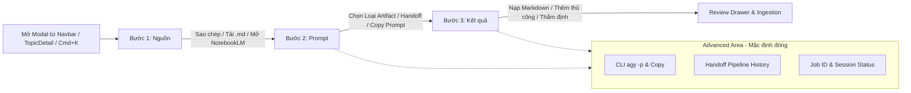

# Feature Spec: NotebookLM Workspace UX Redesign (Phase F8.1)

## 1. Executive Summary & Problem Statement

**Tên tính năng**: NotebookLM Workspace UX Redesign
**Mã phân đoạn**: Phase F8.1 / Integration Suite
**Persona**: Học giả & người dùng Knowledge OS nghiên cứu đa môn (Phật Học, Dịch Học, Đông Y, Ngôn Ngữ Học) muốn chuẩn bị tài liệu nguồn, tạo prompt chuyên dụng và nhập kết quả từ Google NotebookLM nhanh chóng, tối giản thao tác, giảm mật độ thông tin mà không làm mất đi các tính năng kỹ thuật nâng cao.

### Thực trạng hiện tại
1. `NotebookLMStudioModal.tsx` là một monolithic component (1,093 dòng, ~52 KB) hiển thị đồng thời toàn bộ các section trên một màn hình cuộn dọc dài:
   - Topic Selector & Link ngoài
   - Khối Đóng gói tài liệu nguồn (với khung xem trước code/markdown lớn)
   - Khối Sinh Task Prompt cho Antigravity 2.0 (với hàng loạt nút bấm, input, preview prompt, terminal preview, tracker list)
   - Khối Kho kết quả Artifact Locker (với form thêm, context bar, danh sách card artifact)
2. Mật độ thông tin (information density) quá cao, visual hierarchy bị phân tán, khiến người dùng thông thường bị quá tải khi chỉ muốn thực hiện các tác vụ đơn giản: copy nguồn -> mở NotebookLM -> paste kết quả.
3. Các thông tin kỹ thuật chuyên sâu (Headless CLI `agy -p`, Job ID hash, pipeline history tracker, session raw status) chiếm diện tích lớn ở trung tâm giao diện thay vì được giấu gọn trong vùng kỹ thuật nâng cao (Progressive Disclosure).
4. Header và footer có các nút đóng / disclaimers trùng lặp hoặc chiếm ưu tiên thị giác không cần thiết.

---

## 2. Goals & Non-Goals

### Goals
- **Giảm mật độ thông tin**: Chia luồng làm việc thành quy trình 3 bước trực quan (Stepper: 1. Nguồn $\rightarrow$ 2. Prompt $\rightarrow$ 3. Kết quả) với nguyên lý **Progressive Disclosure** (tiết lộ lũy tiến).
- **1 Primary CTA duy nhất cho mỗi bước**: Định hướng hành động rõ ràng cho người dùng ở từng giai đoạn của luồng nghiên cứu.
- **Bảo toàn 100% Business Behavior**:
  - Không thay đổi bất kỳ logic tổng hợp nguồn nào (`packageSourceForNotebookLM`).
  - Không thay đổi định dạng prompt sinh ra (`generateNotebookLMTaskPrompt`).
  - Bảo toàn định dạng lệnh headless CLI (`buildAntigravityCLICommand`) và logic hàng đợi job (`AntigravityHandoffJob`).
  - Bảo toàn toàn bộ REST API contracts (`/api/research-sessions`, `/api/artifacts/*`).
  - Tái sử dụng trọn vẹn `ArtifactReviewDrawer` để thẩm định, phân tích trích dẫn, nhập Note và sinh Flashcards SRS.
- **Header tinh gọn**: Tiêu đề "NotebookLM", subtitle ngắn gọn, 1 nút Close duy nhất tại header.
- **Vùng kỹ thuật nâng cao (Advanced Section)**: Thu gọn lệnh CLI, Job ID, pipeline history, metadata vào collapsible drawer/accordion mặc định đóng, với nhãn trạng thái thân thiện cho người dùng.
- **Tối ưu hóa khả năng tiếp cận (Accessibility - a11y) & Responsive**:
  - WAI-ARIA dialog semantics, focus trap, Escape key dismiss.
  - Phù hợp trên cả laptop viewport (1366x768 / 1920x1080) và mobile/tablet (touch target $\ge 44$px, không tràn viewport).

### Non-Goals (Ranh giới bất biến)
- **KHÔNG thay đổi Prisma schema** hay cơ sở dữ liệu PostgreSQL.
- **KHÔNG thay đổi Express REST API routes** (`artifactRoutes.ts`, `researchSessionRoutes.ts`).
- **KHÔNG thay đổi interface `IDataRepository`** hoặc `DataContext`.
- **KHÔNG thay đổi định dạng persist `localStorage`** (`NOTEBOOKLM_STORAGE_KEY`, `ANTIGRAVITY_HANDOFF_JOBS_STORAGE_KEY`).
- **KHÔNG thêm external UI library** (chỉ sử dụng Tailwind CSS, Lucide icons, React 19 có sẵn trong repo).

---

## 3. User Journey & Step-by-Step UX Flow



### Bước 1: Chuẩn bị Nguồn (Source Step)
1. Người dùng chọn chủ đề cần nghiên cứu (hỗ trợ 8 chủ đề trọng tâm hoặc mở rộng toàn bộ, kế thừa `getCompactTopicOptions`).
2. Xem tóm tắt nguồn: số lượng ghi chú (Notes), tài liệu tham khảo (Resources), liên kết tri thức (Knowledge Links).
3. Khung xem trước nguồn nhỏ gọn (giới hạn chiều cao $\le 160$px, kèm thanh cuộn mượt).
4. Các hành động:
   - **Primary Action**: "Mở Google NotebookLM" (mở tab mới).
   - **Secondary Actions**: "Sao chép nguồn" (copy vào clipboard kèm thông báo), "Tải Markdown" (tải `.md` về máy), "Xem nguồn đầy đủ" (mở rộng modal/drawer xem toàn bộ nội dung).
   - Chuyển sang Bước 2: "Tiếp tục: Tạo Prompt $\rightarrow$".

### Bước 2: Tạo Prompt & Handoff (Prompt Step)
1. Chọn loại kết quả mong muốn (**Artifact Type Selector**):
   - `study_guide`: Study Guide (Giáo trình khảo cứu)
   - `audio_overview_summary`: Audio Overview (Tóm tắt Podcast 2 Hosts)
   - `briefing_doc`: Briefing Doc (Báo cáo tổng kết học thuật)
   - `faq`: FAQ (Bộ câu hỏi & giải đáp)
   - `source_pack`: Source Pack (Gói nguồn chuẩn hóa)
2. Nhập chỉ dẫn bổ sung (tùy chọn).
3. Khung xem trước prompt tự động cập nhật theo loại artifact và chỉ dẫn.
4. Hành động:
   - **Primary Action**: "Chuẩn bị Handoff Antigravity" (tạo job, lưu queue, hiển thị trạng thái).
   - **Secondary Action**: "Sao chép Task Prompt" (copy prompt vào clipboard).
   - Chuyển sang Bước 3: "Tiếp tục: Nhập Kết quả $\rightarrow$".

### Bước 3: Nhập & Quản lý Kết quả (Results Step)
1. Hiển thị danh sách kết quả nghiên cứu đã nạp theo chủ đề hiện hành (kết hợp cả local artifacts và backend grounded artifacts).
2. Khi chưa có kết quả: Hiển thị Empty State trang nhã kèm Quick Switch sang các chủ đề khác đã có kết quả.
3. Hành động nạp kết quả:
   - "Nạp tệp Markdown" (upload file `.md` / `.txt` tự động trích xuất H1 làm tiêu đề).
   - "Thêm kết quả thủ công" (mở form nhập tiêu đề, URL NotebookLM, nội dung).
4. Trên mỗi card kết quả:
   - Tiêu đề, loại artifact badge, version badge (`Source package v1`).
   - Trạng thái người dùng hiểu được: "Mới tiếp nhận" (`received`), "Đã thẩm định" (`validated`), "Đã nhập xong" (`imported`), "Đã lưu trữ" (`archived`).
   - Nút hành động chính: "Thẩm định" (Mở `ArtifactReviewDrawer` để thẩm định, xem trích dẫn `[1]`, nhập thành Note hoặc sinh Flashcard SRS).
   - Nút xóa (với local artifact).

### Advanced / Technical Details (Vùng kỹ thuật thu gọn)
- Nằm ở cuối modal, mặc định đóng dạng accordion (có thể mở ở mọi bước).
- Chứa:
  - Lệnh CLI Antigravity Headless (`agy -p ...`) kèm nút sao chép nhanh.
  - Mã định danh Job (`jobId`), đường dẫn tệp manifest `.agents/handoffs/`.
  - Lịch sử Pipeline Handoff (danh sách job và trạng thái thực thi: Đang chờ / Đang xử lý / Hoàn tất / Thất bại).
  - Trạng thái đồng bộ Backend Session.

---

## 4. Component Decomposition & Architecture

Để tránh cấu trúc monolithic, `NotebookLMStudioModal` được tái cấu trúc thành các sub-components phân tách trách nhiệm đơn nhất (Single Responsibility Principle):

```
src/components/integrations/notebooklm/
├── NotebookLMStudioModal.tsx        # Orchestrator & Modal Dialog Root (State machine & WAI-ARIA)
├── NotebookLMHeader.tsx             # Header tinh gọn (Title, Subtitle, Close button)
├── NotebookLMStepper.tsx            # Navigation bar 3 bước (Pending/Current/Completed/Error)
├── NotebookLMSourceStep.tsx         # Bước 1: Topic Selector, Source Summary, Compact Preview, Actions
├── NotebookLMPromptStep.tsx         # Bước 2: Artifact Type Selector, Instructions, Prompt Preview, Handoff CTA
├── NotebookLMResultsStep.tsx        # Bước 3: Artifact Locker List, Upload/Add Form, Empty State, Quick Switch
├── SourcePreviewModal.tsx           # Drawer/Modal xem toàn bộ nguồn đã chuẩn hóa
├── AdvancedTechnicalDetails.tsx     # Accordion collapsible chứa CLI, Handoff Tracker, Raw Metadata
├── types.ts                         # Sub-component props & step state interfaces
└── utils.ts                         # Pure functions & status label mappers
```

---

## 5. Non-Functional Requirements & Guardrails

| Yêu cầu | Tiêu chuẩn kỹ thuật |
|---|---|
| **Visual Hierarchy** | Tối đa 1 Primary CTA trên mỗi step view. Secondary actions dùng neutral styling. |
| **Dark Mode** | 100% hỗ trợ Dark Mode với bảng màu `stone` (`stone-900`, `stone-950`, `stone-800`, `stone-200`). |
| **Accessibility (a11y)** | WAI-ARIA `role="dialog"`, `aria-modal="true"`, `aria-labelledby`, Focus trap, phím `Escape` đóng modal, không để rò rỉ focus. |
| **Performance** | Không re-render không cần thiết. Giữ dynamic import `React.lazy` tại các điểm gọi (`App.tsx`, `Navbar.tsx`, `TopicDetail.tsx`). |
| **Backward Compatibility**| Giữ nguyên toàn bộ storage keys (`phat_hoc_notebooklm_artifacts_v1`, `phat_hoc_antigravity_handoff_jobs_v1`). |
| **Zero Regression** | 100% test suites hiện có (304 files, 2,026 tests) tiếp tục pass không đổi. |
