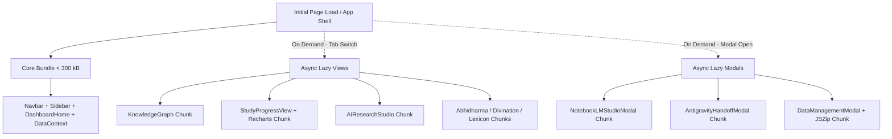

# Technical Specification: Phase Performance-Bundle-Audit & Code-Splitting Strategy

## 1. Executive Summary & Problem Statement

Khi chạy `npm run build`, Vite hiển thị cảnh báo hiệu năng:
```text
dist/assets/index-CJ4_8Tnn.js   1,268.23 kB │ gzip: 347.14 kB
(!) Some chunks are larger than 500 kB after minification.
Consider:
- Using dynamic import() to code-split the application
- Use build.rollupOptions.output.manualChunks to improve chunking
```

### Hiện trạng:
Toàn bộ mã nguồn ứng dụng (11 tabs điều hướng, tất cả các modals, các ma trận dữ liệu và toàn bộ thư viện bên thứ 3) hiện đang được đóng gói nguyên khối (monolithic single chunk) vào `index.js`.
Người dùng mở trang chủ lần đầu buộc phải tải toàn bộ:
- Thư viện biểu đồ `recharts` (~450 kB) dù chưa vào tab Tiến độ.
- Ma trận `AbhidharmaMatrix`, `DivinationMatrix`, `MultilingualLexicon` dù chưa mở Công cụ chuyên sâu.
- Các module AI nặng `AIResearchStudio`, `NotebookLMStudioModal`, `AntigravityHandoffModal`.
- Thư viện nén file `jszip` dù chưa thực hiện sao lưu/xuất dữ liệu.

---

## 2. Evidence & Bundle Composition Breakdown

### 2.1. Phân Tích Kích Thước (Estimated Footprint)

```
Total Bundle: ~1,268 kB (Minified) / ~347 kB (Gzip)
├── Third-Party Vendor Dependencies: ~750 kB (59%)
│   ├── recharts (Biểu đồ & SVG analytics): ~420 kB
│   ├── lucide-react (Hệ thống icons): ~180 kB
│   ├── jszip (Nén/giải nén backup archive): ~95 kB
│   ├── motion (Animation engine): ~60 kB
│   ├── canvas-confetti: ~15 kB
│   └── react + react-dom: ~140 kB
│
└── Application Code & Data Modules: ~518 kB (41%)
    ├── Matrix & Specialized Datasets (Abhidharma, I-Ching, Lexicon): ~160 kB
    ├── AI Studio & Reasoning Handoff Pipelines: ~110 kB
    ├── Knowledge Graph (Interactive Canvas & Topology): ~85 kB
    ├── Search, Modals, Study & Note Managers: ~105 kB
    └── Core Layout, Shell & Data Context: ~58 kB
```

---

## 3. Goals & Non-Goals

### 3.1. Goals
1. **Giảm kích thước Initial JS Chunk**: Đưa initial bundle xuống dưới **500 kB** (ngưỡng an toàn của Vite & chuẩn Web Vitals).
2. **Triển khai Lazy Loading & Code-Splitting cho Tab Views**:
   - Sử dụng `React.lazy()` và `Suspense` cho các màn hình chuyên sâu và nặng: `KnowledgeGraph`, `StudyProgressView`, `AbhidharmaMatrix`, `DivinationMatrix`, `MultilingualLexicon`, `AIResearchStudio`, `AdvancedSearch`.
3. **Triển khai Lazy Loading cho Heavy Modals & Utilities**:
   - Tải `NotebookLMStudioModal`, `AntigravityHandoffModal`, `DataManagementModal` theo nhu cầu (On-demand).
   - Tải động `JSZip` (`await import('jszip')`) chỉ khi người dùng kích hoạt hành động Export/Import ZIP.
4. **Tối ưu hóa Vendor Chunking trong `vite.config.ts`**:
   - Phân chia các vendor chunks riêng biệt (`vendor-react`, `vendor-charts`, `vendor-icons`, `vendor-utils`) để tận dụng tối đa HTTP Caching của trình duyệt.
5. **Bảo toàn 100% Hành vi (Zero Behavior Change)**:
   - Tất cả các tab, modals, phím tắt (Ctrl+K, ?), và luồng điều hướng hoạt động chính xác tuyệt đối như trước, có kèm fallback loading indicator tinh tế, mượt mà.

### 3.2. Non-Goals
1. Không cắt giảm tính năng hoặc xóa bất kỳ component nào.
2. Không thay đổi dữ liệu hoặc API contract.
3. Không làm gãy SSR / backend server build (`esbuild server.ts`).

---

## 4. Proposed Architecture & Implementation Plan

### 4.1. Architecture Diagram: Code-Splitting Strategy



### 4.2. Rollup Manual Chunks Configuration (`vite.config.ts`)

```typescript
build: {
  rollupOptions: {
    output: {
      manualChunks: {
        'vendor-react': ['react', 'react-dom'],
        'vendor-charts': ['recharts'],
        'vendor-icons': ['lucide-react'],
      },
    },
  },
}
```

### 4.3. Lazy Component Loading Pattern in `App.tsx`

```tsx
const KnowledgeGraph = React.lazy(() => import('./components/graph/KnowledgeGraph').then(m => ({ default: m.KnowledgeGraph })));
const StudyProgressView = React.lazy(() => import('./components/progress/StudyProgressView').then(m => ({ default: m.StudyProgressView })));
const AIResearchStudio = React.lazy(() => import('./components/ai/AIResearchStudio').then(m => ({ default: m.AIResearchStudio })));
const AbhidharmaMatrix = React.lazy(() => import('./components/matrix/AbhidharmaMatrix').then(m => ({ default: m.AbhidharmaMatrix })));
const DivinationMatrix = React.lazy(() => import('./components/matrix/DivinationMatrix').then(m => ({ default: m.DivinationMatrix })));
const MultilingualLexicon = React.lazy(() => import('./components/lexicon/MultilingualLexicon').then(m => ({ default: m.MultilingualLexicon })));
```

---

## 5. Risk Assessment & Reversibility

| Hạng mục tối ưu | Mức độ rủi ro | Khả năng đảo ngược (Reversibility) | Biện pháp kiểm soát |
| :--- | :--- | :--- | :--- |
| **Vite `manualChunks`** | Rất thấp (0%) | **100% Reversible** | Chỉ thay đổi cấu hình output bundle của Rollup, không sửa logic code. |
| **Tab Lazy Loading (`React.lazy`)** | Thấp | **100% Reversible** | Bọc `Suspense` với component loading skeleton đồng bộ phong cách UI, kiểm thử đầy đủ qua Vitest. |
| **On-demand Modal Loading** | Thấp | **100% Reversible** | Chỉ render Suspense khi `isOpen === true`. |
| **Dynamic `import('jszip')`** | Rất thấp | **100% Reversible** | Thay thế `import JSZip from 'jszip'` bằng `const JSZip = (await import('jszip')).default` trong handler sao lưu. |

---

## 6. Implementation Roadmap (Thứ Tự Thực Thi Khuyến Nghị)

1. **Bước 1 (Vite Chunking)**: Cấu hình `manualChunks` trong `vite.config.ts` để tách `vendor-charts`, `vendor-icons`, `vendor-react`.
2. **Bước 2 (Dynamic JSZip)**: Chuyển đổi import tĩnh `jszip` trong các tiện ích export/import sang dynamic import.
3. **Bước 3 (Tab Code-Splitting)**: Áp dụng `React.lazy()` và `Suspense` cho các màn hình chuyên sâu trong `App.tsx`.
4. **Bước 4 (Modal Code-Splitting)**: Áp dụng `React.lazy()` cho các modals tích hợp lớn.
5. **Bước 5 (Verification & Benchmark)**:
   - Chạy `npm run build` để đối chiếu kích thước chunk trước và sau tối ưu.
   - Chạy full test suite (`npx vitest run`) xác nhận 100% tests pass và không có regression.
