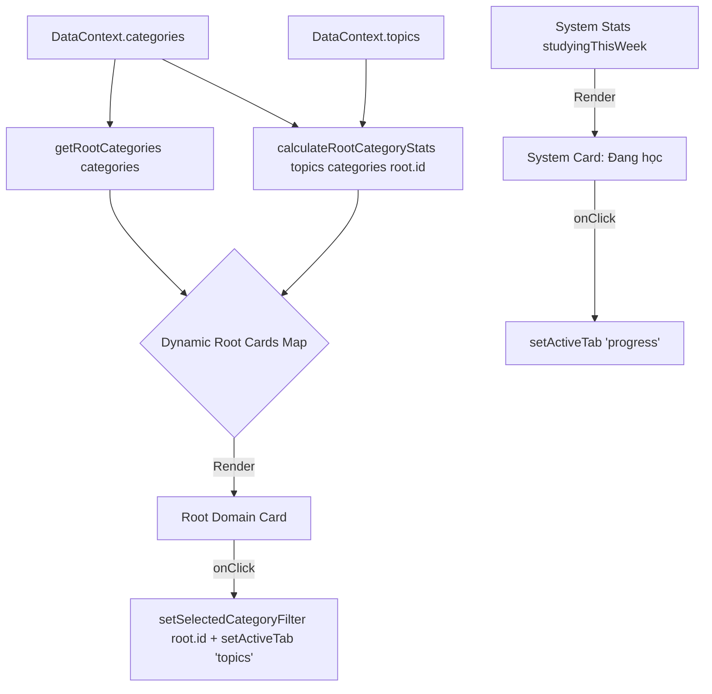

# Đặc Tả Kỹ Thuật: Dynamic Dashboard Domain Cards for Root Categories

> **Trạng thái:** Spec & Implementation Guide (Post-Phase 5 Micro-Fix)  
> **Tài liệu liên quan:** `docs/specs/adr-016-dynamic-root-taxonomy-and-topic-visibility.md`  
> **Người thực hiện:** Staff Software Engineer / Technical Architect  
> **Ngày tạo:** 2026-08-25  

---

## 1. Bối Cảnh & Vấn Đề (Problem Statement)

1. **Hardcode 2 Thẻ Lĩnh Vực Tại Dashboard Home:**
   - Hiện tại, màn hình Tổng quan nghiên cứu (`DashboardHome.tsx`) đang hardcode cố định 2 thẻ thống kê: "Phật học" và "Huyền học" (cùng với thẻ hệ thống "Đang học").
   - Mặc dù hệ thống danh mục đã hỗ trợ thêm lĩnh vực gốc mới động (`Category.parentId === null`) và Sidebar/TopicTree đã tự động cập nhật, Dashboard Home vẫn chỉ hiển thị đúng 2 thẻ cũ.
   - Khi người dùng thêm các lĩnh vực mới như "Kinh tế", "Triết học", "Khoa học tự nhiên"... thẻ tương ứng không xuất hiện trên Dashboard.

2. **Hành vi Điều Hướng Chưa Lọc Đúng Khi Click Card:**
   - Thao tác click vào card "Phật học" hoặc "Huyền học" ở Dashboard trước đây chỉ gọi `setActiveTab('topics')` mà không thiết lập `selectedCategoryFilter`, khiến người dùng chuyển tab nhưng không được lọc đúng vào lĩnh vực đã chọn.

---

## 2. Mục Tiêu & Phạm Vi (Goals & Non-Goals)

### Mục Tiêu (Goals):
1. Mọi Root Category (`parentId === null` hoặc `undefined`) phải được render động thành một thẻ lĩnh vực trên Dashboard Home.
2. Khi người dùng tạo thêm bất kỳ root category mới nào, card tương ứng xuất hiện ngay lập tức trên Dashboard mà không cần can thiệp mã nguồn.
3. Số lượng chủ đề và % hoàn thành trên mỗi card phải được tính toán chính xác theo toàn bộ danh mục con cháu của root category đó.
4. Khi click vào thẻ lĩnh vực, hệ thống chuyển sang tab `topics` đồng thời gán `selectedCategoryFilter = root.id`.
5. Bảo lưu thẻ hệ thống "Đang học" (Tiến độ học trong tuần & thời gian tích lũy) như một thẻ tổng quan hệ thống riêng biệt.
6. Không hardcode bất kỳ tên lĩnh vực nào trong logic render.

### Ngoài Phạm Vi (Non-Goals):
- Không thay đổi cấu trúc cơ sở dữ liệu hoặc schema Prisma.
- Không thay đổi các thẻ chi tiết gần đây (Recent Notes, Recent Topics, Recent Resources).

---

## 3. Kiến Trúc & Luồng Dữ Liệu (Canonical Data Flow)

---

## 4. UI Contract & Styling Matrix

| Root Domain | Icon | Palette / Border | Subtitle / Focus | Action |
| :--- | :--- | :--- | :--- | :--- |
| **Phật học** (`slug/type === 'phat-hoc'`) | `Sparkles` | Amber (`bg-amber-100`, `text-amber-800`, `hover:border-amber-400`) | Child categories / Description | `setSelectedCategoryFilter(id)` $\rightarrow$ `topics` |
| **Huyền học** (`slug/type === 'huyen-hoc'`) | `Compass` | Indigo (`bg-indigo-100`, `text-indigo-800`, `hover:border-indigo-400`) | Child categories / Description | `setSelectedCategoryFilter(id)` $\rightarrow$ `topics` |
| **Lĩnh vực tùy biến** (Root khác) | `Folder` / `BookOpen` | Stone/Blue (`bg-stone-100`, `text-stone-800`, `hover:border-stone-400`) | Child categories / Description | `setSelectedCategoryFilter(id)` $\rightarrow$ `topics` |
| **Hệ thống: Đang học** (System Progress) | `Clock` | Emerald (`bg-emerald-100`, `text-emerald-800`, `hover:border-emerald-400`) | Tổng ghi chú & tài liệu | `setActiveTab('progress')` |

---

## 5. Kế Hoạch Kiểm Thử (Verification Plan)

1. **Test Helper Thuần Túy:**
   - `calculateRootCategoryStats(topics, categories, rootId)` tính đúng `totalTopics`, `completedTopics`, `donePercent` cho root có subcategories và root mới có 0 topics.
2. **Test Giao Diện (`tests/unit/dashboard-root-domain-cards.test.tsx`):**
   - Render đầy đủ các root category card mặc định (Phật học, Huyền học).
   - Render ngay lập tức card mới khi có root category tùy biến (ví dụ: "Kinh tế").
   - Đảm bảo thẻ hệ thống "Đang học" luôn hiển thị cạnh các thẻ lĩnh vực.
   - Kiểm tra click vào card lĩnh vực chuyển tab sang `topics` và gán đúng `selectedCategoryFilter`.
   - Kiểm tra click vào card "Đang học" chuyển tab sang `progress`.
