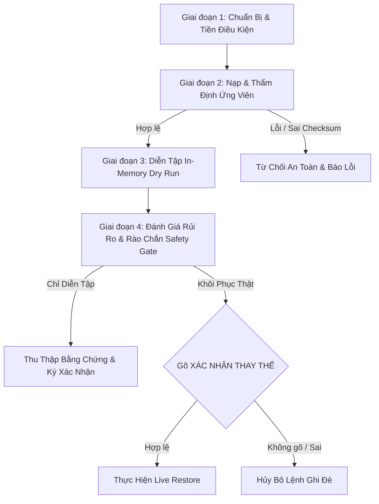

# SPECIFICATION: Post-Phase 6g — Operator Restore Drill Readiness

## 1. Context & Executive Summary
Tiếp nối sự thành công của Phase 6f (**Restore Evidence Pack & Operator Runbook**), hệ thống đã có đầy đủ:
- Bộ fixture kiểm thử chuẩn mực (`valid-snapshot.json`, `legacy-snapshot.json`, `malformed-snapshot.json`, `manifest-mixed-statuses.json`),
- Sổ tay vận hành bằng tiếng Việt (`backup-restore-operator-runbook.vi.md`),
- Cơ chế kiểm toán tệp và tính toán mức độ sẵn sàng sao lưu 3 lớp (`calculateBackupReadiness`).

**Phase 6g (Operator Restore Drill Readiness)** nhằm mục đích chuẩn hóa và kiểm chứng toàn diện **Năng lực Sẵn Sàng Diễn Tập Khôi Phục (Restore Drill Readiness)** của người vận hành. Mục tiêu là đảm bảo mọi học giả/quản trị viên có thể tự tin thực hiện diễn tập khôi phục định kỳ, kiểm tra tính toàn vẹn của dữ liệu và hiểu rõ ranh giới an toàn mà không có bất kỳ rủi ro nào làm tổn hại dữ liệu thật.

---

## 2. Problem Statement & Operational Needs
1. **Ranh Giới Giữa Diễn Tập (Drill) & Khôi Phục Thật (Live Restore):** Người vận hành cần một hành trình rõ ràng (Operator Journey) với các chỉ báo trực quan giúp phân biệt 100% giữa môi trường mô phỏng trong RAM (In-Memory Dry Run) và lệnh ghi đè dữ liệu thật lên hệ thống.
2. **Tiêu Chuẩn Thu Thập Bằng Chứng (Evidence Collection):** Khi diễn tập hoặc xử lý sự cố, người vận hành cần biết chính xác các bằng chứng cần thu thập (Mã băm SHA-256, số lượng biến động delta, danh sách tiêu đề mẫu, trạng thái kiểm toán tham chiếu).
3. **Quy Trình Kiểm Tra Tiền Điều Kiện & Rào Chắn An Toàn (Safety Gates):** Cần một khung đánh giá có hệ thống về các tiền điều kiện (Preconditions) và rào chắn an toàn (Safety Gates) trước, trong và sau diễn tập.

---

## 3. Operator Journey & Workflow Architecture

Quy trình diễn tập khôi phục của người vận hành tuân thủ 5 giai đoạn nghiêm ngặt:

### Chi Tiết 5 Giai Đoạn Vận Hành:
1. **Giai đoạn 1 — Chuẩn Bị & Đánh Giá Tiền Điều Kiện (Preconditions Check):**
   - Đánh giá trạng thái kết nối cơ sở dữ liệu (`dbHealth`: Healthy/Online hoặc LocalStorage Offline fallback).
   - Xuất bản sao lưu App Snapshot JSON và File Manifest JSON hiện tại làm điểm phục hồi (Restore Point).
2. **Giai đoạn 2 — Nạp & Thẩm Định Ứng Viên (Candidate Ingestion & Integrity Check):**
   - Nạp tệp Snapshot JSON ứng viên vào giao diện.
   - Thẩm định cấu trúc schema và tính toán mã băm SHA-256 tức thì qua `validateBackupSnapshotPreflight`.
   - Nếu mã băm sai lệch: Kích hoạt rào chắn Gate 1, dừng ngay lập tức và báo lỗi chi tiết.
3. **Giai đoạn 3 — Diễn Tập Khôi Phục Thuần Túy Trong Bộ Nhớ (In-Memory Restore Drill):**
   - Chạy hàm thuần túy `runRestoreDrill` trên RAM.
   - Hiển thị bảng biến động thực thể: `Δ Chủ đề`, `Δ Ghi chú`, `Δ Tài liệu`, `Δ Danh mục`, `Δ Thẻ`.
   - Hiển thị xem trước các tiêu đề mẫu từ `buildRestorePreview`.
4. **Giai đoạn 4 — Đánh Giá Rủi Ro & Rào Chắn An Toàn (Risk & Safety Gates):**
   - Đánh giá sự khác biệt giữa 2 chế độ Merge (Gộp an toàn) và Replace (Thay thế toàn bộ).
   - Nếu chỉ diễn tập: Dừng lại sau khi có số liệu, không phát sinh bất kỳ write mutation nào.
   - Nếu tiến hành khôi phục thật: Vượt qua Confirmation Gate (nhập `XÁC NHẬN THAY THẾ`).
5. **Giai đoạn 5 — Kiểm Tra Xác Minh Sau Diễn Tập / Khôi Phục (Post-Drill Verification):**
   - Sau diễn tập: Xác nhận live state của ứng dụng được bảo toàn nguyên vẹn 100%.
   - Thu thập bằng chứng và điền vào Bảng Ký Xác Nhận (Operator Sign-off Checklist).

---

## 4. Preconditions & Safety Gates Matrix

| Rào Chắn An Toàn (Safety Gate) | Vị Trí Thực Thi | Cơ Chế Bảo Vệ | Kết Quả Khi Vi Phạm |
| :--- | :--- | :--- | :--- |
| **Gate 1: Checksum & Schema Gate** | `validateBackupSnapshotPreflight` / `validateRestoreCandidate` | Thẩm định Zod Schema Semver 2.x và đối chiếu SHA-256 Checksum bằng `calculateBackupChecksum`. | Chặn nạp dữ liệu, hiển thị banner lỗi đỏ, hủy bỏ tiến trình diễn tập. |
| **Gate 2: In-Memory Dry Run Gate** | `runRestoreDrill` | Tính toán mô phỏng hoàn toàn trên đối tượng RAM, không gọi `localStorage.setItem` hoặc API backend. | Đảm bảo 100% không làm biến đổi dữ liệu thật trong lúc diễn tập. |
| **Gate 3: Explicit Confirmation Gate** | `ExportImportModal` UI (`handleRestoreSubmit`) | Yêu cầu người vận hành nhập chính xác cụm từ `XÁC NHẬN THAY THẾ` khi chọn chế độ Replace. | Nút kích hoạt khôi phục bị vô hiệu hóa (disabled), ngăn chặn bấm nhầm. |
| **Gate 4: Rehydration Preserving Gate** | `DataContext` (`reloadAllData`) | Nếu quá trình làm tươi dữ liệu thất bại, bảo toàn nguyên vẹn in-memory state cũ. | Ngăn chặn việc xóa trắng dữ liệu giao diện khi có lỗi mạng/máy chủ. |

---

## 5. Evidence Pack & Artifacts to Collect

Người vận hành khi thực hiện diễn tập khôi phục định kỳ cần ghi nhận và lưu trữ 4 nhóm bằng chứng:
1. **Thông tin Bản Sao Lưu Ứng Viên:**
   - Tên tệp snapshot (ví dụ: `knowledge-os-snapshot-2026-08-25.json` hoặc `valid-snapshot.json`).
   - Phiên bản schema (ví dụ: `2.0.0` hoặc `legacy`).
   - Mã băm SHA-256 Checksum (chuỗi hex 64 ký tự).
2. **Kết Quả Diễn Tập Khôi Phục (Restore Drill Output):**
   - Chế độ mô phỏng (`merge` hoặc `replace`).
   - Biến động số lượng thực thể (`topicsDelta`, `notesDelta`, `resourcesDelta`, `categoriesDelta`, `tagsDelta`).
   - Tổng số thực thể dự kiến sau khi khôi phục (`simulatedResultState`).
3. **Bằng Chứng Tính Toàn Vẹn Của Live State:**
   - Xác nhận số lượng chủ đề và ghi chú thực tế trong ứng dụng không bị biến đổi sau khi đóng modal diễn tập.
4. **Bảng Ký Xác Nhận Hoàn Thành (Operator Sign-off Record):**
   - Đầy đủ 5 mục kiểm tra theo tiêu chuẩn `RUNBOOK-BK-001`.
   - Chữ ký người vận hành và ngày giờ thực hiện.

---

## 6. Risk Points & State Mutation Safeguards

| Điểm Có Nguy Cơ (Risk Point) | Mức Độ Rủi Ro | Biện Pháp Kiểm Soát & Bảo Vệ Trong Kiến Trúc |
| :--- | :---: | :--- |
| **1. Chọn tệp JSON trong modal import** | Thấp | Chỉ lưu đối tượng đã parse vào local state `parsedSnapshot` của Modal, không truyền vào `DataContext`. |
| **2. Thực hiện tính toán Restore Drill** | Thấp | Hàm `runRestoreDrill` là pure function, tạo bản sao mới (immutable clone) để tính toán delta. |
| **3. Bấm nhầm nút Submit khi chưa sẵn sàng** | Cao | Nút bị khóa nếu chưa chọn file, bị lỗi checksum, hoặc chưa gõ `XÁC NHẬN THAY THẾ` ở chế độ Replace. |
| **4. Mất kết nối máy chủ khi đang nạp dữ liệu** | Trung bình | Kiến trúc Dual-Tier Resilience tự động chuyển hướng đọc/ghi sang LocalStorage fallback, bảo toàn phiên làm việc. |

---

## 7. Acceptance Criteria (Tiêu Chí Nghiệm Thu Phase 6g)
1. Có tài liệu đặc tả `docs/specs/post-phase6g-operator-restore-drill-readiness.md` đầy đủ 5 giai đoạn, 4 safety gates, và danh mục bằng chứng cần thu thập.
2. Có kịch bản hành vi Gherkin `docs/gherkin/post-phase6g-operator-restore-drill-readiness.feature` mô tả chi tiết hành trình diễn tập của người vận hành.
3. Không sửa đổi mã nguồn và không tạo test implementation trước khi vượt qua Human Gate.
4. Trình bày đầy đủ trade-offs, blast radius và các câu hỏi cần phê duyệt trước khi bước sang pha kiểm thử và thực thi.
