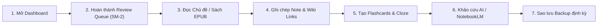

# Cẩm Nang Hướng Dẫn Sử Dụng Knowledge OS (v0.16.0)

**Knowledge OS** là hệ thống quản lý tri thức cá nhân (Second Brain) và trạm khảo cứu học tập đa ngành được phát triển theo kiến trúc **Local-First**. Hệ thống kết hợp phân loại cây chủ đề động (Dynamic Taxonomy), ghi chú liên kết hai chiều (Bi-directional Wiki Links), thuật toán ôn tập lặp lại ngắt quãng SuperMemo-2 (SM-2), thư viện đọc sách EPUB tích hợp, trạm khảo cứu AI có kiểm soát ngữ cảnh (Bounded Context AI Research), cùng cầu nối đồng bộ với Obsidian và Google NotebookLM.

---

## 1. Bắt Đầu Nhanh (Quick Start)

### 1.1. Mục đích của Knowledge OS
Knowledge OS hỗ trợ người học, nhà nghiên cứu và chuyên gia:
- **Hệ thống hóa tri thức**: Tổ chức các khái niệm học thuật thành mạng lưới phân tầng động, loại bỏ các danh mục cố định gán cứng để bạn tự do xây dựng kho tàng kiến thức theo chuyên ngành riêng (Đông Y, Y Dược, Lập Trình, Khoa Học, Kinh Tế,...).
- **Ghi nhớ dài hạn**: Ứng dụng thuật toán khoa học Spaced Repetition (SuperMemo-2) và Flashcards dạng Cloze Deletion để duy trì trí nhớ bền vững.
- **Đọc sách & tài liệu tập trung**: Trải nghiệm đọc EPUB chuyên nghiệp ngay trong ứng dụng với khả năng ghi nhớ vị trí đọc (CFI), bảo vệ dữ liệu với bộ lọc khử lỗi thực thể XHTML an toàn.
- **Mở rộng nghiên cứu với AI**: Đóng gói tài liệu chuẩn 5 phần nạp vào Google NotebookLM hoặc sử dụng AI Research Studio để phân tích chuyên sâu có trích dẫn nguồn gốc (Citations).
- **Liên kết hệ sinh thái**: Cầu nối hai chiều với Obsidian Vault và hỗ trợ xuất/nhập sao lưu an toàn.

---

### 1.2. Khởi động và thiết lập ban đầu

```bash
# 1. Cài đặt các gói phụ thuộc
npm install

# 2. Khởi tạo Prisma Client và cấu trúc cơ sở dữ liệu
npm run db:generate
npm run db:push

# 3. Nạp dữ liệu mẫu khởi đầu (Tùy chọn - Baseline Đông Y)
npm run db:seed

# 4. Khởi chạy môi trường phát triển
npm run dev
```

Sau khi chạy lệnh, truy cập ứng dụng trên trình duyệt tại: `http://localhost:3000` (hoặc cổng hiển thị trên terminal).

---

### 1.3. Lộ trình 10 phút làm quen cho người mới
1. **Phút 1–2 (Màn hình Tổng quan):** Quan sát các chỉ số KPI, tỷ lệ hoàn thành chủ đề, chuỗi ngày học tập (streak) và hàng chờ ôn tập hôm nay (Review Queue).
2. **Phút 3–4 (Cây Chủ Đề):** Mở thẻ **Chủ đề** trên thanh điều hướng, duyệt các nhánh phân cấp (ví dụ: *Đông Y Học*, *Lập Trình*, *Quản Trị*), tạo thử một Root Domain hoặc Topic mới.
3. **Phút 5–6 (Chi Tiết Chủ Đề):** Bấm vào một chủ đề để mở trang làm việc chi tiết. Đọc phần định vị khái niệm, luận thuyết và thiết lập các liên kết tri thức.
4. **Phút 7–8 (Ghi chú & Flashcard):** Viết một ghi chú mới với cú pháp `[[Tên Chủ Đề Khác]]` và tạo thử một Flashcard câu hỏi hoặc Cloze Deletion `{{c1::từ khóa}}`.
5. **Phút 9 (Thư viện Sách EPUB):** Mở thẻ **Thư viện Sách**, chọn một quyển sách để đọc, chỉnh cỡ chữ/font nền và trải nghiệm tính năng lưu vị trí đọc tự động.
6. **Phút 10 (Ôn tập SM-2 & Tra cứu):** Bấm phím tắt `Ctrl + K` (hoặc `Cmd + K` trên macOS) để mở **Command Palette**, chuyển nhanh đến **Studio Ôn Tập** và hoàn thành phiên đánh giá thẻ nhớ đầu tiên.

---

### 1.4. Các khái niệm cốt lõi trong hệ thống

| Khái niệm | Định nghĩa & Vai trò |
|---|---|
| **Root Domain & Category** | Nhóm danh mục gốc và phân tầng danh mục do người dùng định nghĩa động (Server-canonical Taxonomy), lưu trữ linh hoạt trong database. |
| **Topic (Chủ đề)** | Đơn vị tri thức trung tâm. Chứa định vị khái niệm, luận thuyết, liên kết tri thức, tài nguyên tham khảo và tiến độ học tập. |
| **Note (Ghi chú)** | Bản ghi chép cá nhân gắn với chủ đề, hỗ trợ Markdown chuẩn và 4 phân loại: `insight` (chiêm nghiệm), `study` (học tập), `question` (nghi vấn), `summary` (tóm tắt). |
| **Flashcard & Cloze** | Thẻ ghi nhớ Active Recall. Hỗ trợ câu hỏi thường và thẻ ẩn từ ngữ cảnh (Cloze Deletion) quản lý theo thuật toán SM-2. |
| **Resource (Tài nguyên)** | Tài liệu tham khảo dạng liên kết Web (`url`) hoặc đường dẫn tệp trên máy tính (`filePath`). Ứng dụng tuân thủ nguyên tắc *Zero Binary Ingestion* để bảo đảm độ nhẹ và an toàn. |
| **EPUB Book** | Sách điện tử đọc trực tiếp từ thư mục `docs/books` hoặc qua Obsidian Vault với bộ lọc lỗi XML/XHTML an toàn. |
| **Knowledge Graph** | Sơ đồ mạng lưới trực quan hóa các mối liên kết đa chiều giữa Topic, Note và Resource dạng đồ thị lực tương tác. |

---

## 2. Hướng Dẫn Chi Tiết Từng Khu Chức Năng

### 2.1. Tổng Quan (Dashboard)
- **Mục đích:** Trung tâm điều hành học tập, phản ánh toàn cảnh khối lượng tri thức và định hướng phiên làm việc trong ngày.
- **Các thành phần chính:**
  - **Thống kê KPI:** Tổng số chủ đề, ghi chú, flashcards, thời gian học tập tích lũy.
  - **Hàng chờ ôn tập (Due for Review):** Danh sách các chủ đề và flashcards đến hạn ôn theo thuật toán SM-2.
  - **Hành động gợi ý tiếp theo (Next Action Strip):** Đề xuất thông minh giúp bạn tiếp tục chủ đề đang dang dở ngay lập tức.
  - **Phân bổ danh mục & Retention Rate:** Biểu đồ tỷ lệ ghi nhớ và tiến độ hoàn thành theo từng lĩnh vực.

---

### 2.2. Quản Lý & Cây Chủ Đề (Topic Tree)
- **Mục đích:** Khám phá, lọc và tổ chức toàn bộ cây tri thức phân cấp.
- **Thao tác chính:**
  - **Tạo Root Domain & Phân cấp:** Bấm **Tạo Mới** để thêm miền tri thức mới hoặc chủ đề con trực thuộc.
  - **Lọc theo trạng thái:** Lọc theo `Chưa học`, `Đang học`, `Đã xong`, `Đang ôn`.
  - **Tìm kiếm tức thì:** Tìm kiếm chủ đề theo tên hoặc tags phân loại.
  - **Kéo thả / Mở rộng cây:** Đóng/mở các nhánh cây tri thức để giữ không gian làm việc gọn gàng.

---

### 2.3. Chi Tiết Chủ Đề (Topic Detail)
- **Mục đích:** Không gian làm việc sâu tích hợp toàn diện cho từng chủ đề.
- **Các thẻ chức năng:**
  1. **Nội Dung (Content):** Trình bày phần tóm tắt định vị, luận thuyết chi tiết với định dạng Markdown phong phú.
  2. **Ghi Chú (Notes):** Soạn thảo ghi chú với hỗ trợ cú pháp liên kết `[[Wiki Link]]`. Nhấp vào liên kết để chuyển nhanh đến chủ đề tương ứng.
  3. **Liên Kết Tri Thức (Relations):** Thiết lập quan hệ giữa các chủ đề: *Tương hỗ (Related)*, *Tiền đề (Prerequisite)*, *Nâng cao (Advanced)*, *Tương phản (Contrasting)*.
  4. **Tài Liệu (Resources):** Quản lý đường dẫn web hoặc tệp cục bộ trên máy.
  5. **Ôn Tập SM-2:** Chấm điểm ghi nhớ từ 0 đến 5 để cập nhật chu kỳ ôn tập tự động.
  6. **Tích hợp:** Nút bấm xuất bản nhanh sang **Obsidian Bridge** hoặc **NotebookLM Studio**.

---

### 2.4. Flashcards & Studio Ôn Tập (SRS Studio)
- **Mục đích:** Công cụ củng cố trí nhớ dài hạn dựa trên nguyên lý Active Recall & Spaced Repetition.
- **Cách tạo Flashcard:**
  - **Thẻ thường:** Nhập mặt trước (Câu hỏi) và mặt sau (Đáp án).
  - **Thẻ Cloze Deletion:** Bôi đen từ khóa và bọc trong cú pháp `{{c1::từ khóa cần ẩn}}`.
- **Phím tắt trong phiên ôn tập:**
  - Phím `Space`: Lật thẻ xem đáp án.
  - Phím `1` (Again - Quên hoàn toàn): Đưa thẻ vào ôn lại ngay.
  - Phím `2` (Hard - Khó nhớ): Rút ngắn chu kỳ ôn tiếp theo.
  - Phím `3` (Good - Nhớ tốt): Tăng chu kỳ ôn theo hệ số chuẩn.
  - Phím `4` (Easy - Quá dễ): Tăng hệ số dễ nhớ `easeFactor` và kéo dài chu kỳ.

---

### 2.5. Thư Viện & Trình Đọc Sách EPUB (EPUB Library & Reader)
- **Mục đích:** Đọc sách điện tử chuyên khảo phục vụ học tập và đối chiếu tài liệu nguồn.
- **Tính năng nổi bật:**
  - **Nguồn sách linh hoạt:** Đọc trực tiếp các tệp `.epub` đặt trong thư mục `docs/books` hoặc liên kết từ Obsidian Vault.
  - **Bảo toàn dữ liệu & Resilience:** Tích hợp bộ xử lý `epubXhtmlSanitizer` giúp khử sạch các lỗi thực thể XML/XHTML mà không làm biến dạng tệp gốc.
  - **Lưu trạng thái thông minh:** Tự động ghi nhớ vị trí đọc (CFI), tỷ lệ hoàn thành cuốn sách và các bookmark đánh dấu.
  - **Tùy chỉnh thị giác:** Thay đổi font chữ, kích cỡ chữ, giãn dòng và chế độ nền sáng / tối / sepia.

---

### 2.6. Khảo Cứu AI & NotebookLM Studio
- **Mục đích:** Trợ lý học thuật phân tích chuyên sâu và chuẩn hóa tài liệu nguồn.
- **AI Research Studio (Bounded Context):**
  - Nghiên cứu có kiểm soát: Tổng hợp câu trả lời dựa trên ghi chú chủ đề, tài nguyên và tài liệu chọn lọc từ Obsidian Vaults.
  - Trích dẫn minh bạch (Citations): Mọi luận điểm phân tích đều hiển thị rõ ràng nguồn tham chiếu.
  - Xuất bản: Lưu trực tiếp kết quả phân tích thành ghi chú mới chỉ với 1 click.
- **Google NotebookLM Studio:**
  - Đóng gói dữ liệu nguồn chuẩn 5 phần (*Định vị, Luận thuyết, Ghi chú, Liên kết, Trích dẫn*).
  - Sao chép nhanh hoặc xuất tệp `.md` sạch nạp vào Google NotebookLM để tạo podcast Audio Overview và Study Guides.
  - **Artifacts Locker:** Quản lý kho lưu trữ cục bộ các tài liệu tóm tắt và giáo trình sau khi làm việc trên NotebookLM.

---

### 2.7. Biểu Đồ Tri Thức (Knowledge Graph)
- **Mục đích:** Trực quan hóa cấu trúc dữ liệu mạng lưới dưới dạng đồ thị tương tác.
- **Tính năng:**
  - Phóng to/thu nhỏ và kéo thả tương tác các nút tri thức.
  - Lọc hiển thị theo loại nút (Topic, Note, Resource) hoặc theo nhánh danh mục.
  - Nhấp vào nút mạng để xem tóm lược và chuyển tiếp tức thì đến màn hình chi tiết.

---

### 2.8. Tra Cứu Toàn Năng & Command Palette
- **Mục đích:** Tìm kiếm tức thì trong toàn bộ kho dữ liệu với thuật toán BM25 hỗ trợ tiếng Việt có dấu và không dấu.
- **Phím tắt toàn cục:**
  - `Ctrl + K` (Windows/Linux) hoặc `Cmd + K` (macOS): Mở bảng lệnh Command Palette.
  - Nhập từ khóa để tìm kiếm nhanh Chủ đề, Ghi chú, Sách EPUB hoặc chuyển trang màn hình.

---

### 2.9. Cầu Nối Obsidian (Obsidian Bridge)
- **Mục đích:** Kết nối đồng bộ kho tri thức Knowledge OS với phần mềm ghi chú cá nhân Obsidian.
- **Tính năng:**
  - Hỗ trợ xem tài liệu Obsidian với modal tối ưu phím `Escape` và tiêu chuẩn ARIA dialog.
  - Trình phân giải Wiki Link (`[[...]]`) và nhúng nội dung transclusion (`![[...]]`).
  - Xuất cấu trúc thư mục chuẩn kèm trang bản đồ nội dung `00_Map_Of_Content.md`.

---

## 3. Quy Trình Vận Hành Học Tập Tiêu Chuẩn



### 3.1. Quy trình hằng ngày (15 – 30 phút)
1. **Bước 1 (2 phút):** Mở **Tổng quan**, xem các mục trong hàng chờ ôn tập hôm nay.
2. **Bước 2 (5 phút):** Hoàn thành phiên ôn tập nhanh với các thẻ flashcard hoặc chủ đề đến hạn.
3. **Bước 3 (10–15 phút):** Chọn chủ đề tiếp theo từ mục *Next Action* hoặc mở sách từ *Thư viện EPUB* để đọc nội dung mới.
4. **Bước 4 (5 phút):** Viết ít nhất một ghi chú mới (loại `insight` hoặc `study`) và gắn liên kết `[[...]]` tới các chủ đề liên quan.
5. **Bước 5 (3 phút):** Tạo 2–3 thẻ flashcard cloze ngắn cho các từ khóa cốt lõi vừa học.

### 3.2. Quy trình khảo cứu chuyên sâu cuối tuần (45 – 60 phút)
1. **Tổng duyệt:** Rà soát lại biểu đồ tiến độ học tập và đồ thị Knowledge Graph để tìm các khoảng trống kiến thức.
2. **Nghiên cứu nâng cao:** Sử dụng **AI Research Studio** kết hợp tài liệu từ **Obsidian Vault** để phân tích so sánh đa chiều.
3. **Đóng gói NotebookLM:** Xuất tài liệu nguồn của chủ đề sang Google NotebookLM để nghe podcast tóm lược Audio Overview.
4. **Sao lưu an toàn:** Mở modal **Quản Lý Dữ Liệu**, bấm **Tải Bản Sao Lưu JSON** để lưu trữ dự phòng toàn bộ cơ sở dữ liệu về máy.

---

## 4. Quản Trị Dữ Liệu & Khuyến Nghị An Toàn

### 4.1. Kiến trúc lưu trữ Dual-Tier Persistence
- **Server Database (PostgreSQL):** Đóng vai trò là nguồn dữ liệu chuẩn mực (Server-canonical source of truth) khi chạy trong môi trường có kết nối backend.
- **LocalStorage Fallback:** Trong trường hợp mất kết nối mạng hoặc môi trường độc lập, ứng dụng tự động lưu trữ an toàn trong bộ nhớ trình duyệt, đảm bảo không làm gián đoạn phiên học.

### 4.2. Các lệnh bảo trì và kiểm thử quan trọng

| Mục đích | Lệnh thực thi | Ghi chú |
|---|---|---|
| Khởi chạy Dev Server | `npm run dev` | Chạy ứng dụng ở môi trường phát triển |
| Chạy bộ Unit Tests | `npm test` hoặc `npx vitest run` | Kiểm tra tính đúng đắn của toàn bộ 292 test suites |
| Kiểm tra kiểu TypeScript | `npm run typecheck` | Xác thực tính toàn vẹn kiểu dữ liệu |
| Cập nhật Schema Database | `npm run db:push` | Đồng bộ schema Prisma với cơ sở dữ liệu |
| Build Production | `npm run build` | Đóng gói ứng dụng để triển khai |
| Chạy Production Server | `npm start` | Khởi động server production |

---

## 5. Các Câu Hỏi Thường Gặp (FAQ)

### ❓ Tôi có thể tự tạo danh mục và lĩnh vực riêng không?
**Hoàn toàn có thể.** Từ phiên bản v0.16.0 Commercial Baseline, hệ thống sử dụng cấu trúc phân tầng động. Bạn có thể tự do tạo mới, chỉnh sửa và sắp xếp các Root Domain và Category theo bất kỳ chuyên ngành nào bạn mong muốn.

### ❓ Tệp sách EPUB và PDF có bị tải lên máy chủ không?
**Không.** Ứng dụng vận hành theo nguyên lý *Local-First* và *Zero Binary Ingestion*. Các tệp sách EPUB và tài liệu cục bộ chỉ được đọc trực tiếp trên máy của bạn và không bị tải nhị phân lên server cơ sở dữ liệu.

### ❓ Làm thế nào để di chuyển dữ liệu sang máy tính khác?
Bạn chỉ cần mở modal **Quản Lý Dữ Liệu** $\rightarrow$ chọn **Xuất Bản Sao Lưu (JSON)**. Ở máy tính mới, mở Knowledge OS và bấm **Nhập Bản Sao Lưu (JSON)** để khôi phục toàn bộ cây chủ đề, ghi chú, flashcards và tiến độ học tập.

### ❓ Phím tắt tiện ích nhất trong ứng dụng là gì?
- `Ctrl + K` / `Cmd + K`: Mở nhanh Command Palette để tìm kiếm và chuyển màn hình.
- `Space`: Lật thẻ trong phiên ôn tập Flashcard.
- `1`, `2`, `3`, `4`: Đánh giá nhanh mức độ nhớ thẻ SRS.
- `Esc`: Đóng nhanh các modal popup đang mở.
